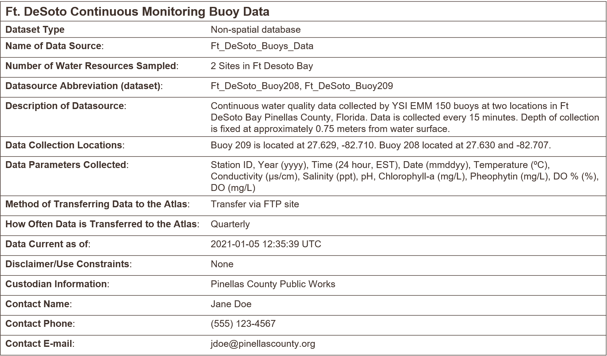

# Key Concepts and Principles {#keys}

Before we get started, we need to discuss some basic ideas around data and their management.  Understanding these concepts and why they're important will facilitate the development and curation of open data for both you and others to use.  Some of these concepts are very general, whereas others may seem fairly specific.  The detailed concepts may seem daunting, but they are critical in supporting your journey in managing your own data.

## Identifying important contributions

We briefly introduced a general concept of data in section \@ref(dataimp).  Throughout this document, we use the term "data" to describe a variety of products either directly supporting decision-making processes or used for research to support the former.  Data can be generated to support or refute hypotheses in research, whereas research can also produce data products that support environmental management.  The end game in all of these processes is understanding that data can be present at any stage in research and/or decisions that support environmental management.  Individuals may generally use the term "data" to describe products at any point in this workflow.  Understanding the diferent ways we talk about data will allow you to more carefully identify your data management needs.    

Identifying the types of data that are important to support decision-making is the first task in developing a data management workflow.  Any research project could produce countless datasets and it may be challenging to understand which datasets are important or are merely intermediate steps in a larger process.  To help you identify which datasets are important to your project, ask these questions:

1. What is the most important and tangible contribution of this project?  
1. Who is going to benefit from the results of this project? 
1. How can I use data management practices to make the use of these data "easier" for decision-making?

Answers to these questions can help you identify important data products that need formal data management workflows.  However, coming to a single answer is the exception, not the norm, and a typical answer usually is "it depends".  Also realize that you may be the direct beneficiary of a particular research project - documenting and using proper data management workflows will save you from headaches in the future.  Evaluating these questions at different steps throughout a project can help you identify the valuable contributions. 

In a perfect world where we have endless time and resources, and not to mention interest, to dedicate to data management, we would track and document the provenance of every single dataset used by a research project.  Of course, this is impractical and we do not need to curate every piece of data.  You will need to identify the most important contribution of a project among alternatives based on your answers to the above questions.  Here are a couple scenarios that can help in this process. 

> I am collecting field data and/or running experiments in a laboratory.

The field or experimental data are obvious candidates for developing a data management workflow, yet it is rarely a solitary dataset that is produced.  Working with these data continuously throughout a project will benefit from developing a data dictionary (section \@ref(dict)) and understanding linking keys between different data tables.  If you don't want or need to archive all the datasets you've used or created, identify a master dataset that provides the main results for your study.

> I am using data from an external source as primary or secondary information to support analysis or generate a reporting product

A derived dataset may be the most important contribution of this project.  This dataset includes multiple combinations of input datasets from external sources.  It is important to document the steps that were used to develop this dataset, including the raw sources of information and where they can be accessed.  Documentation can range from a general description of the dataset (less desirable) to complete access to source code for reproducing the derived dataset (more desirable).  The most important contribution may be the workflow or the derived dataset, depending on "who" can benefit most from this project. 

> I am producing a model to support scenario exploration or understanding of natural processes

Tracking data provenance of a modelling project is a challenging task simply because a "model" does not conform to the conventional understanding of data.  As noted above, we describe data as anything that can support decision-making in environmental management.  Models are commonly used for this task, yet understanding of their information content over time often rests with one individual, giving that modeller a very high bus factor.  There are practical limitations for fully tracking a model as a data product (e.g., computational limits, time requirements, required knowledge of its working components), but there are certainly derived datasets from models that can benefit from data management.  In particular, model results, parameters, or source code are all prime candidates for data management, depending on the audience. 

> I am developing a decision-support tool 

Related to the challenges of data management for modelling, so-called "decision-support" tools are increasingly used as a front-end for decision-makers to access relevant information from a research project or intensive data collection effort. Online interactive dashboards have proliferated tremendously in the last ten years to meet this need.  These tools can be useful in the right hands, yet there is no community standard for how to treat these products as data to track their origin and metadata.  In this case, documenting the workflow, source code, and requisite datasets for powering the dashboard may be the most important contributions.

In summary, identifying the most important data contribution is a challenge that can guided through careful evaluation of the above.  This may lead you to choose one or more data products to develop a data management workflow for a specific project.  These could include:

* Tabular data either as standalone or as several tables linked by common keys
* Derived or synthesis data, often tabular, created as the sum of other, disparate datasets
* Model output or model information that describe environmental processes or likely outcomes of management scenarios
* Workflows to creating a data product, which could include analysis code as a continuous pipeline from source to product
* An online dashboard to support user engagement with data

## The FAIR principles

The previous section presented several questions to ask yourself that can aid in identifying important contributions of a research project as a focus for data management.  In all cases, once that important contribution is identified, community standards or best practices for that dataset or product should be used to ensure the intended audience can find, access, use, and replicate the data.  The FAIR principles [@Wilkinson16] provide some general guidelines to follow for ensuring the openness of a data product.  The FAIR acronym is described as follows:

* **F**indable: The data have a globally unique and persistent identifier, including use of "rich" metadata.
* **A**ccessible: Once found, the data can be retrieved using standardized communications protocols that are open, free, and universally implementable.
* **I**interoperable: The ability of data or tools from non-cooperating resources to integrate or work together with minimal effort.
* **R**eusable: If the above are achieved, the data and metadata are described in a way that they can be replicated and/or combined in different settings.  

What this means simply is that 1) each dataset has a name that doesn't change and can be found with minimal effort using that name, 2) once it's found, you can actually get your hands on it (e.g., not behind a paywall), 3) once you have it, you can use readily available tools to work with the data (e.g., not using proprietary software), and 4) you can actually apply the data for your own needs because it has sufficient context, including its reproduction, given the the first three principles are met.  

In practice, the FAIR principles invoke several concepts that will be described in detail later, but we describe some here as a gentle introduction.  The term "globally unique and persistent identifier" (under **F**) is a mouthful that simply means the dataset has a name assigned to itself that is not assigned to any other dataset (globally unique) and it's permanent (persistent).  This doesn't mean a descriptive or literal name, such as you would assign to a file on your own computer, rather it means a computer-generated identifier created using a known standard.  One such example is a [DOI](https://www.doi.org/), or digital object identifier.  These are commonly assigned to publications as a static web address (unique and persistent) and are increasingly being used as identifiers for datasets.  

Findable and accessible also imply the data have a home with an address.  The latter describes the unique identifier, whereas the home itself is permanent location as a requirement for accessibility.  There are several options for where data can live long-term and theoretically forever so long as the internet exists.  There are literally thousands of repositories online that can be used for data archival and the answer to which repository you should use is almost always going to be "it depends".  We provide some examples in section \@ref(tools) as one option used by TBEP.

The FAIR principles are not rigorous standards, rather they establish general questions you should ask of a dataset to make sure you've done your due diligence in achieving openness.  Further, because they are not rigorously defined, different organizations may interpret the principles differently and it's important to realize that your understanding of the principles may differ from others.  For example, individuals may define "reusable" in different ways that can affect the level of detail provided in the metadata. These principles are presented here as a reminder to think about them often, especially during the beginning of a project, and how they can be applied in opening the most important contribution of your project. 

## The importance of tidy data

So far we have covered a variety of data products ranging from tabular data to more abstract definitions that may include analysis pipelines or online services.  Tabular data are by far the most recognized and most common data type and it's worth covering a few basic principles for managing these data that will help you tremendously in the long run.  At their core, tabular data are a simple conceptual model for storing information as observations in rows and variables in columns, yet its very common to try to make a table more than it should be.  Unless you spend a lot of time working with data, it can be difficult to recognize common mistakes that lead to table abuse.  

Before we get into tidy data, I want to rant a bit about Excel.  It may seem elitist, but my intentions are pure. There are [many examples](http://www.eusprig.org/horror-stories.htm) that demonstrate how Excel has contributed to the abuse of tables and even to the detriment of science [@Ziemann16]. Although it is a very interesting and clever program, it is not software developed for data storage.  It is a graphical user interface masquerading as database software. It includes many tools that may appear useful for organizing information, but that ultimately increase risk and make your life as an analyst more difficult.  Excel allows you to abuse your data in many ways, such as adding color to cells, embedding formulas, and automatically formatting cell types.  The problem occurs when this organization becomes ambiguous and only has meaning inside the head of the person who created the spreadsheet.  For example, color may be used to fill cells of a given category and this may seem harmless, but in doing so, you've not only created more data, but you've created data that have an ambiguous meaning.

If you absolutely must use Excel to store data, the only acceptable format you should use as a responsible data steward is a rectangular, flat file.  We mean rectangular as only rows and columns in matrix format (e.g., 10 x 5, 12 x 4, etc.), with no "dangling" cells outside of the grid or more than one table in a spreadsheet.  We mean flat file as no cell formatting, no embedded formulas, no multiple spreadsheets in the same file, and data entered only as alphanumeric characters. This will ensure that there is no ambiguous information and a machine will have no problem reading your spreadsheet.  Your data will be pure and simple and not abused. @Broman18 provide an excellent guide that expands on these ideas.

Now that that's out of the way, we can introduce some additional principles for tabular data that will improve how they are used in downstream analysis pipelines.  The "tidy" data principles developed by Hadley Wickham [@Wickham14] are a set of simple rules for storing tabular data that have motivated the development of the wildly popular tidyverse suite of R packages [@Wickham19].  The rules are simple: 

1. Each variable must have its own column
1. Each observation must have its own row
1. Each value must have its own cell

Graphically, these rules are shown in figure \@ref(fig:tidy). 

```{r tidy, fig.cap = 'A representation of the rules for tidy data (from @Wickham17).'}
knitr::include_graphics('img/tidy-1.png')
```

If you're already using the rectangular, flat file format, adopting the tidy principles should be a breeze. Using these principles may seem unnatural at first because of a difference between what's easy for entering data vs what makes sense for downstream analyses.  The former is what leads to abuse of tables.  For examples, dates are often spread across multiple columns, such as having one column for each year of data where the header indicates the year.  This convention may be used because it's easy to add another year of data as an additional column as the data become available.  Howver, this is not a tidy format because the date variable occurs across columns.  If you wanted to evaluate changes across years, you'd have to reorganize these data in a tidy format.   

Using a tidy data format also allows you to more easily merge or join data between tables.  This is a common task when analyzing data where you have information spread between different tables because 1) it might not make sense to keep the data in a the same table, but 2) the analysis depends on information from both tables.  For examples, perhaps you want to evaluate how a measured variable at different locations changes across space.  You might have one table that includes station metadata (e.g., site, location) and another table that includes field observations (e.g., site, collection date, field data).  Keeping the station metadata in a tidy format in one table makes sense because these data will not change, whereas the keeping field data in another table would make sense because you collect much more information that may be collected at different times.  Including station coordinate information in the same table as the field data would create redundant information because you need a value for location for every row you have field data.  This is redundant and unnecessary.  

If you're using a tidy format, it's simple to join two tables for analysis.  This requires identifying a linking variable or "key" that is a common identifier between tables.  In the above example, this would be the station identifier.  Other situations may require identifying more complex keys depending on your analysis question.  Our question above related to evaluating differences in location between stations, so the station is a logical choice for a key.  For all cases, a key is used to resolve a uniquely identifiable value that can be used to link observations.A more involved example is provided in section \@ref(oyster).

 * Basic database principles
     * logical extension of tidy data
     * normalized tables (including discussion of key variables), what are unique ids (e.g., tberf oyster, how did I make the unique id?), facilitate standard DB queries

## Metadata 

Just as "data" can have different meanings to different people, "metadata" is a loosely defined term that describes one of the most important aspects of data management.  Metadata varies from simple text descriptions of a dataset, such as "who", "what", "when", "where", "why", and "how", to more formalized standards with the intent of preparing your data for archival in a long-term repository.  Having no metadata is almost a guarantee that your dataset will be orphaned or misused by others, either inadvertently or with willful acknowledgment that the original purpose of the data is unknown and its use may be inappropriate for the task at hand.  Metadata are also important for enabling discovery of your data (the __F__ in FAIR).  So, when you think of data management, you should think of it as synonymous with metadata curation. 

At its basic level, metadata is literally defined as "data about data" or "information about information".  A more comprehensive definition is provided by @Gilliland16:  

> A suite of industry or disciplinary standards as well as additional internal and external documentation and other data necessary for the identification, representation, interoperability, technical management, performance, and use of data contained in an information system

We use this definition as a starting point to develop our thinking around best practices for metadata generation and curation.  Again, it's good to emphasize that some metadata is way better than no metadata at all.  Just because you are not using industry or disciplinary standards for generating metadata doesn't mean you're approach is incorrect.  As you get comfortable with the general purpose of metadata and how it's developed as a description for a dataset, you can build on this knowledge by adopting more formalized standards for developing metadata.   

At its basic level, think of metadata as a simple text file containing the information about your dataset. This text file provides answers to common questions about the origin of your data so that anyone (or a computer) with zero knowledge about your data can quickly orient themselves as to what the data represents and its purpose.  The US Geological Survey provides a useful document on creating [Metadata in "plain language"](https://prd-wret.s3.us-west-2.amazonaws.com/assets/palladium/production/atoms/files/Metadata%20in%20Plain%20Language_508compliant.pdf) to distill the basic information contained in a metadata file.  As indicated above, it provides a workflow for answering the "who", "what", "when", "where", "why", and "how" questions for metadata.  We provide a brief synopsis of these questions below. You can use this workflow to generate your own metadata.

> What does the dataset describe?

Information here would include very basic details about the dataset including a **title**, **geographic extent**, and **period of time** covered by the data.  For geographic extent, this may often include explicit coordinates covering the study area, i.e., the lower left and upper right of a bounding box.  Location is useful for indexing your dataset relative to others, if for example, a researcher wanted to find data for all studies in the geographic extent of Tampa Bay. Other useful information about the "what" might include the type of data, e.g., tabular, map, online dashboard, etc. 

> Who produced the dataset? 

This would be yourself and anyone else who has made a significant contribution to the development of a dataset.  People may have differing opinions regarding what defines a "significant" contribution, but as the curator of a dataset, it's up to you to determine how important it is for including an individual as a contributor.  Data are increasingly being used as citable resources and including individuals that were important in its generation ensures proper attribution.  For scientific publications, each author is generally expected to have made substantial contributions to the study conception and design, data acquisition or analysis, or interpretation of results.  The same would apply to data.  If someone has spent hours toiling in the field to collect the data or hours visually scanning a spreadsheet for quality control, include them!

> Why was the dataset created? 

Describing why a dataset was created is critically important for developing context.  If others want to use your data, they need to know if its appropriate for their needs.  Here you would describe the goal or objectives of the research for which the data were collected.  It should be clear if there are limitations in your data defined by your goals.  For example, you may have collecte field data in a particular time of year to address questions about seasonal changes.  Using these data to answer broader temporal questions, such as inter-annual changes, would not be inappropriate and could lead to wrong conclusions if someone using your data were not aware of this limitation.  Identifying the "why" of your dataset could also prevent misinterpretation or misuse of the data by non-specialists.  Think of it as an insurance policy for your data.

> How was the dataset created? 

Here you would describe the methods used to generate the data, e.g., field sampling techniques, laboratory methods, etc.  This information is important so others can know if you've used proper and accepted methods for generating the data.  Citing existing SOPs or methods that are recognized standards in your field would be appropriate.  If you are generating a synthesis data product using data from external sources, make sure to document where those data come from and the methods you used for synthesis.  Pay attention to documenting the software that was used, including the version numbers.  If you have analysis code or script that was used for synthesis, provide a link if possible.   

> How reliable are the data? 

It's also very important to document aspects of a dataset that affect reliability.  The answers you provide to the above questions can provide context to this reliability, but it's also imporant to explicitly note instances when the data could be questionable or inappropriate to use.  Here you could describe any quality assurance or quality control (QAQC) checks that were used on the data.  There are often formalized ways to do so, such as codes or descriptors in tabular data defining QAQC values (e.g., data in range, below detection, sensor out of service, etc.).  You will want to clearly describe what each of these codes mean and if they cover the range of conditions possible for your data.  Other QAQC procedures, such as how the data were verified for accuracy, can also be described.   

> How can someone get a copy of the dataset?

Good metadata always has information on who has the data and how to contact them for requesting access.  For archived or publicly available data, this information is more important for who to contact should someone have questions.  Information on obtaining a copy of the data should also describe any special software or licensing issues related to accessing the data.  Under the **I** in FAIR, you should strive to make your data as interoperable as possible and not store your data in an obscure format that requires specialized software.  If this is unavoidable (e.g., your data are large and it needs to be compressed), describe what needs to be done to access the data.  Any licensing or permissions issues on using data should also be described, e.g., is it free for use with or without attribution, are there limitations on its use, etc. The [licensing chapter](https://r-pkgs.org/license.html) in @Wickham15 is a great place to start to learn more about licensing.  Although this chapter relates to code licensing, the same principles could apply to data.

### Metadata examples 

Now that we've covered the general concepts of what is included in metadata, we provide some examples of what this looks like in practice.  At it's simplest, metadata can simply be a text file that includes information on the questions above. Below is one such example of metadata that accompanies a dataset that we describe in section \@ref(desoto).  

```{r desotometa, fig.cap='A simple example of metadata illustring the principle that something is better than nothing.', echo = F}

```

Just by looking at the metadata, we can quickly understand some basic information about this dataset. It describes some water quality monitoring data at two buoys near Ft. DeSota in Pinellas Co, Florida.  We can see the type of data, how often it's collected, what equipment was used, the location of the buoys, some contact information should there be questions, and other items that provide context.  Although it doesn't cover all of the questions above, I would be more than happy to use this data since I have some basic knowledge about what's included.  

The example in figure \@ref(fig:desotometa) represents the bare minimum of what should be done to document metadata. This metadata is an excellent example of the principle that __some metadata is better than no metadata__. So many datasets lack even the simplest information to facilitate their use by others. At its core, metadata should serve the purpose of providing information about information.  No matter the level of specificity or metadata standard that was used, all metadata serve this need.  However, more formalized approaches to documenting metadata can play an importane role in prepardng a dataset for discovery by others and long-term archiving. The next section provides one example of a metadata standard that could be used for environmental datasets.   

### The EML standard

There are countless standards for metadata that go beyond the simple descriptive text shown above. These standards provide a formalized approach or "schema" to documenting metadata that provides context about a dataset that is also machine readable.  The latter component is critical for making sure that all datasets prepared for hosting or archiving at a data repository follow the same standards for documenting metadata.  The core pieces of information (who, what, when, where, why, and how) are included, but in a formalized way to allow for rapid searching and queries when the data are stored along with hundreds to thousands of other datasets. 

One such standard that is useful for environmental data is the [Ecological Metadata Language](https://eml.ecoinformatics.org/) or EML.  The EML standard defines a comprehensive vocabulary and a readable XML markup syntax (fancy talk for machine readable) for documenting research data.  Importantly, the standard is community maintained and developed for environmental researchers who want to openly share their data.  The EML standard is also used by the [Knowledge Network for Biocomplexity](https://knb.ecoinformatics.org/) or KNB, which is an online repository that is federated with a much larger network of online data repositories. 

The EML metadata file is an XML file that looks something like this: 

```{r emlsimple, fig.cap='A very simple example of an EML file for metadata, shown as an XML file.', out.width = '70%', echo = F}
knitr::include_graphics('img/emlsimple.PNG')
```

The file in figure \@ref(fig:emlsimple) might look complicated, but it's just a way to document the basic components of metadata so that a machine can read them.  Regarding the descriptive role of metadata, the above example provides a title for the dataset, a brief description, and who to contact.  All the rest is additional information about the standard that was used and basic XML tags to identify parts of the document. The EML provides many more standards to document all other types of metadata information for the questions described above.  

A specific reason why EML is mentioned here is the availability of additional software tools to help create EML files for your data.  In particular, the [EML](https://docs.ropensci.org/EML/) R package provides these tools to streamline metadata creation.  Nobody wants to type an XML file by hand, so   
the EML packages provides a set of functions where a user can input basic metadata information to create the XML file automatically.  All you need is a basic understanding of R and metadata to use the EML package for your own needs. More information can be found on the website: https://docs.ropensci.org/EML/

Of course, you can always manually enter your metadata when you submit a dataset to an online repository. Most repositories, KNB included, provide a form entry system for doing so.  This may not be the most efficient choice, but is often the preferred for first-timers that may not yet be comfortable using other tools to generate metadata.

### Data dictionaries {#dict}

A final note about metadata relates to data dictionaries and what they mean for describing a dataset. A data dictionary can be used for tabular datasets to describe column names and the type of data in each column.  This can be incredibly useful for understanding context of a dataset, which is why we include a short description here in the metadata section.  However, data dictionaries also have importance for more general best practices for data management.  Simple things like how you name a data column can have larger implications for downstream analysis pipelines or interpretability of a dataset.  In metadata, a data dictionary can be as simple as the example in figure \@ref(fig:desotometa) for the parameters that were collected.  There we see the column names, units, and formats for time variables.  This is invaluable information for others that might want to use your data. 

Here we provide some general guidelines for developing your own data dictionary.  This is all information that can be included in metadata, but it is also useful to consider for data management.  

> Column names

Be as descriptive as possible while trying to keep the name as short as possible. Really long names with lots of detail can be just as frustrating as very short names with very little detail.  Ideally, the description of data in a column can be included in metadata, but the column name should also be intuitive to point the analyst in the right direction.  Try to avoid spaces in column names since some software may interpret that as the start of a new column. 

> Column types

Each column includes only one type of data, e.g., numerical measurements, categorical descriptors, or counts of observations.  Never, ever mix data types in the same column.  If your data are continuous numeric values, try to identify an acceptable range for the values, e.g., are there minimum or maximum values that would indicate the data are out of range?    Also make note of the units that were used.  For categorical descriptors, identify all possible categories that are acceptable values for the column, e.g., small, medium, or large for a qualitative descriptor of size.  For dates, make note of the format, e.g., YYYY-MM-DD.  For time, identify the timezone. 

## Where do data live? 

Identifying a location for where you data can be stored long-term can be just as important as using best practices for data curation.  Hosting your data in an online repository makes your data findable and accessible by others and also ensures that your data are of sufficient quality to adhere to standards for the repository.  There is a staggering variety of online repositories, many of which are domain-specific, and it can be difficult to find the best repository that is suitable to your needs.  

As with metadata, the same rule applies to online data storage - something is better than nothing.  Making your data available in a location that can be accessed by others, including metadata, is much, much better than not sharing your data at all, even if that location is not an "official" data repository.  For this purpose, online FTP websites, for example, can be sufficient.  Of course, the major drawback of not hosting your data on an official repository is that others can't easily find the data.  You can of course send the link to anyone that's interested, but this means they need to know the data exist to request the link in the first place. A useful scenario is that you include the location of the data as a supplement link in a published paper or technical report.  

Hosting data on [GitHub](https://github.com/) is another simple solution to making your data available to a larger community.  GitHub is neither a federated repository, nor is it setup specifically for long-term data storage.  However, if you already use GitHub and you want to do something rather rather than nothing at all, GitHub can be a useful solution to begin opening your data.  GitHub was initially setup as an online platform for software or code version control, so it doesn't have all the hallmarks of a conventional data repository.  GitHub also does not work well with large datasets (e.g., more than 100 Mb).  However, it can work well for smaller datasets and offers other amenities that can help you work towards the FAIR principles. For example, the URLs are stable (in the sense that they don't change), a DOI can be attached to your data (e.g., through [Zenodo](https://zenodo.org/)), the data are publicly accessible if you choose to make them so, and you can include any appropriate supplemental information (i.e., metadata files). GitHub can be especially useful if your data product is a workflow that includes code to create a tool for environmental decision-making.

A better, but more involved, solution for opening data is using a federated data repository. These are networks of distributed nodes or individual repositories that collectively use similar standards in archiving data.  They address the problem of multiple disconnected archival systems that are difficult to navigate.  For example, the [KNB](https://knb.ecoinformatics.org/) repository is one node of the larger [DataONE](https://www.dataone.org/) federated network.  DataONE includes other repositories that are domain-, industry-, or regionally-specific that collectively fall under a more generic category of environmental or earth sciences data.  All nodes in the larger DataONE network can be easily navigated and have full infrastructure support from DataONE. 

The main advantage of hosting your data in a federated repository is that it will be truly discoverable - it can be found online through standard search queries.  No prior knowledge is needed about the data for someone to find the information.  For example, perhaps someone is interested in finding datasets within a specific geographic location.  They can search the federated network with these criteria and your dataset will be returned if it's within the boundaries.  Your metadata includes that information as a queryable attribute.  Another advantage is that your data should live on in perpetuity, so long as the internet exists.  As mentioned above, GitHub can be a location to store data for open access, however, there is no guarantee that GitHub will always be available as an online service. Federated repositories take great measures to ensure the long-term viability of their resources, including multiple distributed backups in different locations and interoperability of datasets across platforms.  You receive those benefits as a guarantee when your data are hosted on these services. 
