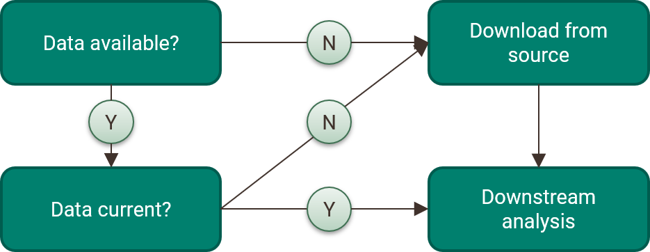
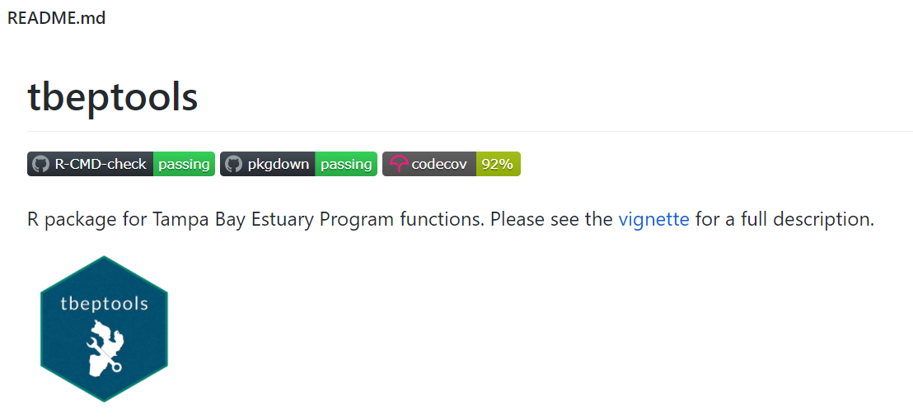

# Data Management Workflow {#workflow}

This section is in two parts to first describe a workflow that we use internally at TBEP to manage our data in section \@ref(philo) and then to describe a road map for opening internal or external datasets at your own organization in section \@ref(howyou).  The first section expands on our philosophy for using open science to manage data, including specific workflows we use, as context to the second section.  Our approach is one way of applying open science to managing data.  Applying the same approach at your organization may or may not be appropriate depending on your internal and external needs for managing data.  As such, our approach is generalizable and modular - any of the approaches can be modified in part or together for your own needs. 

## The TBEP approach

### Our philosophy {#philo}

Sections \@ref(opengeneral) and \@ref(philogeneral) introduced you to our basic philosophy and approach to managing data at TBEP.  As an organization that facilitates science, management, and outreach activities among our local partners, we adopt open science as a cornerstore strategy that will serve the Program's core values.  This approach is made explicit in our [Strategic Plan](https://drive.google.com/file/d/11xohuoaHDxNHRqgXoOHdI37FpWvac_rn/view?usp=sharing) that describes how we achieve programmatic goals defined under our [Comprehensive conservation and Management Plan](https://indd.adobe.com/view/cf7b3c48-d2b2-4713-921c-c2a0d4466632) (CCMP) and who we can work with in our [Interlocal Agreement](https://drive.google.com/file/d/1iJcWxmc5SeyDTqiCQ3MLQGWEY_EDGtZT/view?usp=sharing) to help us achieve our goals. 

Our data [Quality Management Plan](https://drive.google.com/file/d/1DyA0PNHV8rEXGMwGiyS7sXY1ECLYpJJO/view) (QMP, @tbep1620) is a companion document to this SOP that ensures the data used by TBEP for decision-making has known and documented quality and is being used appropriately. The QMP establishes an internal process for verifying data quality standards that conform with federal requirements we have as an organization funded in part by federal dollars under Section 320 of the [Clean Water Act](https://www.epa.gov/laws-regulations/summary-clean-water-act).  On the other hand, this SOP is a more hands-on and accessible document that describes a how-to approach for data management that we adopt as an organization.  The SOP goes beyond the QMP by exposing the process and ideas behind how we manage data at TBEP so that others can learn from our experience.  We encourage you to also view our QMP to understand the literal benchmark we use to ensure quality of our data.

We actively work to apply open science to every activity we pursue to achieve our goals under the CCMP.  Open science is a philosophy and set of tools to make research reproducible and transparent, in addition to having long-term value through effective data preservation and sharing [@Beck20].  We use a definition from the [Creative Commons](https://creativecommons.org/about/program-areas/open-science/) for open science as:

> Practicing science in such a way that others can collaborate and contribute, where research data, lab notes and other research processes are freely available, under terms that enable reuse, redistribution and reproduction of the research and its underlying data and methods

There are a couple key words from the definition that we can extract - collaborate, contribute, reuse, redistribute, reproduce.  These concepts channel some of the ideas described by the FAIR principles (section \@ref(fair)).  We can further elaborate on these key words by defining open science as a set of four core principles (Dan Gezelter <http://openscience.org/what-exactly-is-open-science/>. 

1. Transparency in experimental methods, observations, and collection of data.
1. Public availability and reusability of scientific data.
1. Public accessibility and transparency of scientific communication. 
1. The use of web-based tools to facilitate scientific collaboration and reproducibility.

Why is this so important?  Environmental science is very much in the business of applied science, meaning that research that is conducted to develop an understanding of the environment can be used to support the protection and management of a resource.  We need to understand a problem before we can pursue actions to remedy a problem, especially if the wrong decision can be costly.  Active and useful channels of communication must exist for the lessons learned from science to be applied to real world problems.  Applied science can be facilitated with open science to create these channels. 

Without getting too much into the history of how insular practices among academics have contributed to closed science, it's useful to briefly discuss some of reasons why science may not be translated into action.  As a generalization, researchers are trained to study and document details.  Progress in science is based on 1) an intimate understanding of details that guide process and  2) convincing your peers through rigorous review that you actually understand the details you claim to understand.  As a result, we catalog progress in ways that are true to the scientific process, often as dense texts with every last detail noted.  Many researchers not being taught otherwise will often assume that this is an effective way to communicate scientific results to non-scientists.  What we don't realize is that those that need this information to make decisions do not communicate this way because they are not in the business of scientific discovery. Unless they have a personal interest, they don't care about the science behind the decision, only that the science is right to justify the decision.  The most ineffective approach for a scientist to inform environmental management is to deliver a dense 500 page report and assume it provides an effective vehicle for an environmental manager to make a rational decision.  This is not applied science - it is "implied science" because we implicitly decide that our conventional modes of scientific communication will influence managment or policy. 

In addition to communication barriers, other challenges to applied science include irreproducible results, information loss, inaccessible data, and opaque workflows (section \@ref(whymanage), Figure \@ref(fig:divide)).  These challenges affect how science is delivered to decision-makers, how much trust a decision-maker can have in the science behind the decision, and how likely the science can be used as a springboard for more science.  Effective data management as a subset of the broader principles of open science can help bridge the "research-management divide" and help develop continuity of scientific products that can benefit the larger research community.    

```{r divide, out.width = '80%', fig.cap = "Challenges to bridging the divide between scientific products created in research and informed decisions for environmental management.", fig.align = 'center', echo = F}
knitr::include_graphics('img/divide2.png')
```

### The open science cake

Truly applied science facilitated by open science allows for research results or data to connect with different audiences along a spectrum.  It allows research to be shared with other researchers, be connected with decision-makers, and be accessible to the general public.  Where an individual consumes scientific information along the spectrum depends on their interest, need, or level of background knowledge about a subject.  A solid technical foundation is a prerequisite for sharing information and open science methods allow various elements of the research foundation to be accessible to different end users.  We meet our audience where they're at, rather than assuming they can find their way to the details they need. 

We can describe this metaphor as the __open science cake__ (figure \@ref(fig:cake)).  We use this metaphor because everybody loves cake and it conveniently describes our philosophy to delivering science in an applied context.  This delicious cake is a gradient of information from top to bottom.  At the top, the information is more general (e.g., educational material for public consumption) or can be used to inform action (e.g., what needs to be done to remedy a problem).  At the bottom, the information has specificity and forms the foundation for generality or action.  The bottom of the cake is large, reflecting the decades of research and technical resources that are available to inform the management of Tampa Bay (our [library](http://tbep.org/library), for example).  The bottom also includes resources that can be used to springboard additional research, such as analysis code and source datasets.  Individuals at the top of the cake probably don't want a slice at the bottom, but the slice they take from the top would not exist without support from the bottom.

```{r cake, fig.cap = 'The open science cake showing the connection between research, environmental decisions, and the public.'}
knitr::include_graphics('img/cake.png')
```

Most of our partners that we work with are professionals from resource management or local government agencies that have some vested interest in the protection and restoration of Tampa Bay.  This is our primary audience that we can inform for decision-making.  Broadly speaking, this is the audience that needs distilled information from research products but with a level of specificity that goes beyond education materials.  These individuals are in the middle of the cake and the slices they take are actionable science products, such as interactive dashboards, automated report cards, and other decision support tools.  The middle part of the cake is where conventional science becomes truly applied science.

The cake also emphasizes a vertical connection among the layers that allows an individual to take a slice as high or as low in the cake as they want.  This is a critical principle of open science that speaks to accessibility of information at all levels of the scientific process.  Most of the time, an individual will take a slice from the cut at the level that's appropriate for their needs.  However, we want our science (and data) to be transparent and accessible under the FAIR principles and someone can take a slice at a different level if they have a need to do so.  This also speaks to developing a community of practice for open science - access to the tools and the ability to use them to reproduce or expand on existing products.  

Our web products on the [data visualization](https://tbep.org/our-work/data-vizualization/) section of our web page allow an individual to take slices of the cake at different levels.  The website is setup as a series of cards (cakes) for each reporting product that act as an entryway (top of the cake) to different levels of each cake.  If someone clicks on the [Water Quality Report Card](https://tbep.org/water-quality-report-card/) for example, they get to a web page that has very general information about the reporting product and links to our [summary pdf](https://drive.google.com/file/d/124FXmLcXKYUf3ktaVOvFejndiPS0m7K7/view?usp=sharing) that distills over forty years of water quality data for the Bay.  There are links on the right side of the page that provide access to the building blocks of the report card, including the online dashboard, source code for the report card, build status of the report (more on this in section \@ref(automation), citable DOI, and technical documents that describe the science behind our water quality assessment approach.  These links provide the path to the lower levels of the cake.    

### How do we build the cake? {#automation}

The cake is a useful metaphor to describe how we apply open science to achieve applied science, but how is this done in practice?  How are the layers of the cake actually linked to one another?  We use several open source programming tools to link source data to reporting products with the goal of producing the most timely information for decision-makers with minimal overhead by internal staff.  In this section, we describe these tools and how we link them together to crate a workflow that is both automated and reproducible.

The workflow we use to link source data to reporting products for our [annual water quality assessment](https://tbep.org/water-quality-report-card/) is shown in figure \@ref(fig:osworkflow). The process begins by accessing an external data source from our partners.  In this case, this workflow accesses a spreadsheet of water quality data on an [FTP site](ftp://ftp.epchc.org/EPC_ERM_FTP/WQM_Reports/) maintained by the Hillsborough county Environmental Protection Commission (EPC).  These data are processed with a suite of open source tools, including R, RStudio, relevant data wrangling packages, and tools for document preparation.  The open source tools we've created are also hosted online on [GitHub](https://github.com/tbep-tech) which serves two goals.  First, providing the tools on GitHub makes them discoverable and accessible to others and second, they are integrated into an automated process to make sure the most current data are used. Once the build process for the report card is done, the final products as a Shiny web application and our two-page PDF report are hosted on the TBEP website.

```{r osworkflow, fig.cap = 'The TBEP open science workflow connecting source data to decision-support products.'}
knitr::include_graphics('img/os-workflow.png')
```

The core component of this entire workflow is the [tbeptools R package](https://tbep-tech.github.io/tbeptools/) [@Beck21].  This software was developed using the [R programming language](https://cran.r-project.org/) to read, analyze, and visualize data that we use to report on progress in achieving CCMP goals.  Most of the data tools on our web page depend on functions within the tbeptools package to work with the raw data provided from our partners. Although tbeptools is primarily used by TBEP staff, the package is provided free of use (under the [MIT license](https://tldrlegal.com/license/mit-license)) for anyone interested in exploring the data on their own.  Importantly, all source code is available on GitHub so that anyone with an interest can understand exactly what is done to process the data we use for reporting.  This is a very literal definition of method transparency.  

There are several functions in the tbeptools package that are built specifically for reporting on water quality, all of which are explained in detail in the [introduction vignette](https://tbep-tech.github.io/tbeptools/articles/intro.html) for the tbeptools package. A "vignette" in the R world is a plain language document that explains how to use functions in a package.  Currently, the tbeptools package includes five vignettes, one for each indicator that has reporting functions available in the package:

* [Intro to TBEP tools](https://tbep-tech.github.io/tbeptools/articles/intro.html): A general overview of the package with specific examples of functions for working with the water quality report card
* [Tampa Bay Nekton Index](https://tbep-tech.github.io/tbeptools/articles/tbni.html): Overview of functions to import, analyze, and plot results for the Tampa Bay Nekton Index
* [Tampa Bay Benthic Index](https://tbep-tech.github.io/tbeptools/articles/tbbi.html): Overview of functions to import data for Tampa Bay Benthic Index, under development
* [Tidal Creeks Assessment](https://tbep-tech.github.io/tbeptools/articles/tidalcreeks.html): Overview of functions to import, analyze, and plot results for the assessment of tidal creeks in southwest Florida
* [Seagrass Transect Data](https://tbep-tech.github.io/tbeptools/articles/seagrasstransect.html): Overview of functions to import, analyze, and plot results for the seagrass transect data collected in Tampa Bay

Each vignette is setup similarly by explaining the functions used to read, analyze, and visualize the data.  In fact, every function name in the package is named with an appropriate prefix for what it does, e.g., `read_transect()` reads seagrass transct data, `anlz_transectave()` analyzes annual averages of seagrass frequency occurrence, and `show_transect()` shows a plot of the transect data.  The examples in the vignette further explain how to use the functions and what each function does when working with the data.  

The functions in tbeptools used to read data into R were all built to ensure the most recent data are used for analysis.  Each data import function follows a decision tree shown in figure \@ref(fig:readchk), where a set of internal checks are done to see if the data are available on your computer, compares the data to the online source, and downloads the most recent version if a local file doesn't exist or your current file is out of date.  This process also ensures that any downstream reporting products are using the most current data.  For example, the web page for the [water quality assessment])(https://tbep.org/water-quality-report-card/) has a provisional report card that is based on the most recent water quality data available from EPC.  Although the "official" report card is published at the beginning of each year, provisional data throughout the year can be used to assess water quality changes in near real time.

```{r, out.width = '80%', echo = F, fig.cap = "Internal checks used by the tbeptools R package to ensure the most current data are used for analysis."}

```

The workflows we've created that access source data to create reporting products depend on data being online in a stable location.  This underlies the importance of proper data management practices.  We cannot create and use the reporting products without a findable and accessible location for the source data.  The data we use for our various indicators are distributed at different locations depending on who maintains the information and this includes a mix of FTP sites, Microsoft Access databases, JSON files, or geospatial data hosted through a third party website.  The various locations, data formats, and depths of available metadata are a potential concern for long-term viability of these workflows.  A majority of the locations where these data are found are not formal data archives and there are not any "official" standards for how these data are made available.  Because of this, a long-term goal for TBEP and our partners is to work towards a shared data management infrastructure that more closely follows the FAIR principles.

A critical part of the workflow in figure \@ref(fig:osworkflow) is automation.  We have developed the functions in the tbeptools package with this in mind, i.e., making sure the most up to date data are used without having to manually download the data.  We also leverage continuous integration/continuous deployment (CI/CD) services through GitHub that automate our workflows.  The CI/CD services simply mean that we've setup automated checks and processes based on different triggers that happen when we do something to a project that we've put on GitHub.  For example, every time we push a change that we've made on a local version of tbeptools to the main repository on GitHub, a set of automated checks are used to make sure we didn't break anything in the package.  The badges you see on GitHub and the main TBEP website indicate if the checks were successful or not.  These provide a quick scan of whether or not you should expect the package to work if you were download it from its current state in the repository.   

Many of the README files for the different GitHub projects we maintain include one or more "badges" that indicate of our CI/CD processes are working as we hope.  For example, the README file for our tbeptools R package includes three badges that indicate the status of different CI/CD processes (figure \@ref(fig:badges).  The first badge, R-CMD-Check, shows if the set of standard checks for R packages are passing.  There are dozens of checks for R packages, including things like making sure the documentation is up-to-date, file sizes aren't excessive, the file structure is setup correctly, the examples run without errors, etc. (see [chapter 19](https://r-pkgs.org/r-cmd-check.html)in @Wickham15 for a full description of these checks).  The second "build" badge shows if the [website](https://tbep-tech.github.io/tbeptools/) for the package has been successfully built with the last change to the repository, i.e., does information on the website reflect the package in its current state?  Finally, the "codecov" badge provides a general estimate of how much code in the package includes unit tests as part of best practices for software development. 

```{r badges, echo = F, fig.cap = 'An example of the status badges included in the README file for the tbeptools R package.'}

```

The CI/CD workflows are completely customizable to suit the needs of a given project. The badges in the previous example simply indicate if the CI/CD checks for a package and its website are working correctly.  These are often included in README files to give users a piece of mind that our development processes are following accepted community standards.  Other badges can indicate if a custom workflow is up to date, such as for our automated reporting products.  The water quality report card has a provisional draft that uses the most recent dataset from EPC.  The CI/CD process is setup rebuild the pdf by running a custom "build" file that imports the data, analyzes the results, and creates the plots, all using function from tbeptools. The output graphics are embedded in a type of document preparation system that mixes plain text and code to dynamically generate a static pdf.  All of this is accomplished in the build file, which is triggered daily through the CI/CD services on GitHub.  The CI/CD badge for this repository indicates if the daily build was run and if the provisional pdf was successfully created.  Many of our reporting products leverage these services and you can view the status from its appropriate badge we've placed on our main TBEP website. 

### More on Git and GitHub

GitHub is a foundational tool that is central to our data management workflow.  We've described how it can be used as an intermediate solution for hosting data (section \@ref(datahome)) and how we use it to share and automate our reporting workflows (section \@ref(automation)).  Our use of GitHub aligns with our broader philosophy of using open science and here we explain some more general concepts about what GitHub can provide to our community to emphasize the value it can have for data management. 

Many people describe Git and GitHub synonymously, but we need to distinguish between the two to develop an understanding of the different services each provides.  First, Git is a formal version control software, whereas GitHub is an online platform for sharing code that uses Git.  It's possible to use Git without using GitHub (i.e., using version control only on your personal computer) and it's possible to use GitHub without using Git (e.g, using GitHub to share a file).  Naturally, using both Git and GitHub together can help leverage the benefits of each. The relationship between the two is very similar to that of R and RStudio.  Using R by itself is okay, but the value to yourself and others of using the RStudio as a vehicle for R will be greatly enhanced.   

Version control is a way to track the development history of a project.  It serves joint purposes of 1) formally documenting the changes that have been made to code or software, and 2) making sure that the development history is permanent.  Documenting changes provides a transparent record for yourself and others and establishing permanency ensures that any of the changes that are made can be vetted and accessed as needed. Using Git is extra work, but when you need it you'll be glad you've invested your time wisely.  Think of an instance where you've saved different versions of a file with different names because you don't want to delete any of your old work.  You end up with many extra files and no clear way to understand the origin of each file. Git takes care of this for you by providing a navigable insurance plan for your project. 

GitHub lets you share your code under Git version control in an online environment so that you and your collaborators can more easily work together. You can host multiple projects under version control, view the entire history of each project, and allow others to sync up with you work.  GitHub also has tools for tracking "issues" associated with different projects, which provide a simple way to document questions, bug fixes, or enhancements.  GitHub is a near perfect example open source in practice.  Anyone can view and potentially contribute to other people's projects using a platform that ensures everything is fully documented and never erased.

GitHub also includes a variety of other tools that facilitate openness: 

* Release tagging to assign formal version numbers to code, data or software. 
* GitHub actions to create your own CI/CD workflows, our examples in section \@ref(automation ) use these tools.
* Integration with [Zenodo](https://zenodo.org/) for DOI assignments to give your project a stable and permanent address.  You can see these links on many of our projects on GitHub (our [water quality dashboard](https://github.com/tbep-tech/wq-dash), for example).  
* Website hosting, as for our [tbeptools](https://tbep-tech.github.io/tbeptools/) R package
* Attaching licenses to a project with visible links to the usages defined under each license

All of this may sound very specific to software development, but GitHub can take you a long way towards adopting FAIR principles through better data management practices.  The concepts that apply to version control for code and software have parallels for data management and many of the features to facilitate openness in GitHub can also apply do data. Making your data accessible, documenting the changes you've made over time, and to establish a permanent home (e.g., through Zenodo) can all be done with GitHub.  We elaborate on a case study example using GitHub for data in section \@ref(twitter). 

GitHub also lowers the barrier to inclusion for engaging others in a project.  Unless you work with a dedicated team of software or web developers, it's very rare that your colleagues will have experience with Git or even know what it is (although this may be more uncommon in the future).  This doesn't mean that others are excluded from contributing.  For example, anyone can post issues for a project through the simple web interface provided by GitHub.  Changes to source documents can also be made online that can be tracked through version control without having to use Git on your own (e.g., see our contributing section in \@ref(contrib)).  

The TBEP has a [group GitHub page](https://github.com/tbep-tech) where all of our projects exist, including the source content for this SOP. We do this for all of the reasons mentioned above and as an attempt to serve as an example of how open sharing can lead to better science in less time [@Lowndes17]. Anyone can view our pages to understand the source code, see the changes we've made over time, and post issues/edit content to directly contribute.  This has immense value for how we work as a team and with our partners outside of TBEP. 

## How can you manage data? {#howyou}

Ten simple rules for creating a good data management plan: https://journals.plos.org/ploscompbiol/article?id=10.1371/journal.pcbi.1004525

* Section is written as a road map for developing a data product, there will be steps/checkboxes/forms, roughly following figure \@ref(fig:dataworkflow)

```{r dataworkflow, fig.cap = 'A hypothetical and generalized timeline for managing data associated with a project.', out.width = '80%'}
knitr::include_graphics('img/dataworkflow.png')
```

* Modularity is key to reproducibility, it is independent of where you're at in the project
* Setup some kind of flow chart (if this, then that)

### I'm at the beginning of my project

* What type of project am I working on? 
* What types of products am I expecting?
* Which datasets are important? Guidance for determining which datasets are important are expressed in great detail in section \@ref(keys).
* How do I want to make the data accessible?
* What QA protocols should be established?

### I'm somewhere in the middle of my project

* Have I collected data?
* Are my data in tidy format (if tabular)? 
* Have I been documenting metadata? 

### I'm at the end of my project

* Time for damage control

### Metadata workflow

We described general metadata concepts in section \@ref(metadata), but did not provide a workflow for creating or generating metadata.  The process begins by answering the general questions we presented as a summary of those in the [Metadata in "plain language"](https://prd-wret.s3.us-west-2.amazonaws.com/assets/palladium/production/atoms/files/Metadata%20in%20Plain%20Language_508compliant.pdf) document.  Just start by writing the answers down in a simple text file or even as a spreadsheet with columns for each question.  Where the answers to these questions go depends on how formalized you want to make your metadata, which also depends on where you want to make your data accessible.  More informal storage approaches (e.g., GitHub, FTP site) could store metadata as a text file (e.g., in a README document), whereas storing your data in a formal repository would require you to choose an appropriate metadata standard (e.g., EML in section \@ref(eml)). Custom workflows that combine metadata documentation through an online user interface can also be created if you or your team have the capacity to do so [@Jones07].

These steps can be used as a generalized workflow for metadata generation, ideally at the beginning of a project.  How far you go in these steps depends on where you want to store your metadata. 

1. Identify which dataset(s) are important contributions of a project that you intend on sharing and that need metadata (see section \@ref(contribs)). 
1. Draft a general document to answer the "who", "what", "when", "where", "why", and "how" questions in section \@ref(metadata) for each data product.  This can be a simple text file that "accompanies" each data product. A spreadsheet entry from can be useful to import into a program for converting your metadata into a formal standard or for uploading to a data repository. 
1. Convert the metadata document into an appropriate file format based on the metadata standard you're using. For EML, this would be an XML file.

* USGS resources <https://www.usgs.gov/products/data-and-tools/data-management>
* Metadata questionnaire <https://prd-wret.s3-us-west-2.amazonaws.com/assets/palladium/production/atoms/files/MetadataQuestionnaire_508compliant.pdf>
* Data dictionaries <https://www.usgs.gov/products/data-and-tools/data-management/data-dictionaries>

### Let's get it online!

* How to of where do you put your data
