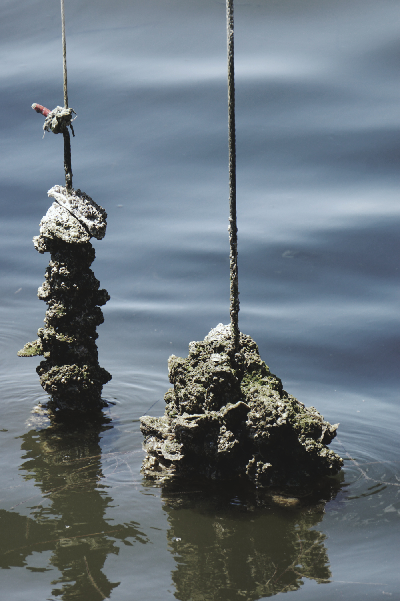

# Case Studies {#cases}

```{r}
library(dplyr)
load(file = url('https://github.com/tbep-tech/tberf-oyster/raw/main/data/oysdat.RData'))
load(file = url('https://github.com/tbep-tech/tberf-oyster/raw/main/data/sitdat.RData'))
load(file = url('https://github.com/tbep-tech/tberf-oyster/raw/main/data/wqmdat.RData'))
```

In this section we describe three case studies to demonstrate how data management workflows are developed in the wild.  In section \@ref(automation), we presented a comprehensive workflow for how we developed our water quality report card.  The examples in this section are similar by adopting elements of the previously described workflow, but with some important differences. The examples here represent data products resulting from TBEP and partner-funded research as opposed to a specific reporting product and, more importantly, all of the data management workflows for these projects were developed after the projects were started.  This is a no-no for data management, but we provide these examples to demonstrate how we've applied the principles in this document to inopportune but realistic situations. Each example describes the general goals and questions of the project, then outlines the thought process to identifying and documenting important data products.

## Oyster restoration in Tampa Bay {#oyster}

```{r, out.width = '50%', fig.cap = 'Restoration of oyster reefs (*Crassostrea virginica*) is a critical management goal to support key habitats in Tampa Bay.'}

```

Establishment and restoration of oyster reefs in Tampa Bay is a critical programmatic goal defined under our [Comprehensive Conservation and Management Plan](https://indd.adobe.com/view/cf7b3c48-d2b2-4713-921c-c2a0d4466632) [@tbep1017] and [Habitat Master Plan Update](https://drive.google.com/file/d/1Hp0l_qtbxp1JxKJoGatdyuANSzQrpL0I/view) [@tbep0720].  Oyster reefs are formed by the cumulative build up of shell material over time and provide food and habitat, reduce erosion, stabilize shorelines, and improve water quality.  Recreational and commercial harvest of oysters are also important activities that contribute to the value of Tampa Bay.  The historical distribution of oyster populations in Tampa Bay is poorly documented, although anecdotal evidence suggests current coverage of oysters Tampa Bay is far less than previously observed.  Establishment and restoration of oyster reefs have been fundamental activities to re-establish sustainable populations in the Bay.  

Critical questions on factors that contribute to the successful establishment or restoration of oysters in Tampa Bay need to be answered to achieve our programmatic goals.  Data have recently been collected to evaluate long-term success of natural and restored sites, including location in the Bay, seasonal timing of restoration activities, and preferred restoration materials under varying conditions.  In addition, standardized monitoring protocols for restoration sites to evaluate or estimate long-term success are needed.  This project involves establishing restoration sites at different locations and collecting field data to address relevant questions. 

At the time of writing, field data have been collected for the first year of the project and is stored in multiple spreadsheets in an Excel workbook (figure \@ref(fig:oysexc)).  The field data is a likely candidate for the most important data contribution of this project and a plan for curating these data has recently been developed.  This plan is primarily focused on answering questions to identify which factors promote long-term success of oyster reefs, with the intent of formatting the data for analysis to answer these questions and delivering the data in a way to reproduce the results.  Environmental managers (e.g., partners that conduct restoration) may have interest in the results (i.e., analysis outcomes), whereas outside researchers may have an interest in using the raw data to support follow-up analysis or to integrate the information with other datasets.   

```{r oysexc, fig.cap = "A screenshot of the raw oyster data from the first year of field work.  The data are close to tidy, but information is spread across tables with no easy way to link between them.", out.width = '100%'}
knitr::include_graphics('img/oysterexcel.PNG')
```

The current approach for managing these data has focused on adopting a tidy format for the existing information.  Because field data collection has already begun, we developed a post-hoc workflow to wrangle the information into flat files with appropriate keys to link data between tables.  Identifying a permanent home for these data and formal documentation of metadata have not been done, although tidying the data will aid analysis and facilitate documentation and delivery of final data products when the time is right (e.g., sooner rather than later).  In this example, we focus on the steps to tidy the data. 

Our tidying workflow for the first year of field data is available in a GitHub repository: https://github.com/tbep-tech/tberf-oyster. The raw data are available in the `data/raw` folder and processing to make them "tidy" is accomplished through a custom analysis script at `R/dat_proc.R`.  The analysis script converts the raw data present in multiple sheets in the Excel workbook to three separate tidy tables.  We use functions from the tidyr and dplyr R packages as part of the tidyverse [@Wickham19] to format relevant information from the raw data to create the separate tidy tables.  This process also involved discussion with project partners when ambiguous labels were observed in data or presented as conflicting information between tables.   

The final "tidy" tables include three flat files for the site data (table \@ref(tab:tabsitdat)), water quality data at each site (table \@ref(tab:tabwqmdat)), and oyster data at each site (table \@ref(tab:taboysdat)).  

```{r tabsitdat}
knitr::kable(head(sitdat), caption = 'First six rows of the site data.', label = 'tabsitdat')
```

```{r tabwqmdta}
knitr::kable(head(wqmdat), caption = 'First six rows ofthe water quality data.', label = 'tabwqmdat')
```

```{r taboysdat}
knitr::kable(head(oysdat), caption = 'First six rows of the oyster data.', label = 'taboysdat')
```

Each table is in a tidy format with 1) each variable having its own column, 2) each observation in its own cell, and 3) each value having its own cell.  The only exception to these rules is the `id` column which is a combination of site name, restoration type (bags, domes, shell, etc.), installation year, and installation season.  This column violates the third rule of tidy data by including multiple values (site name, type, etc.) in one cell.  However, the creation of the `id` column was purposeful to achieve two goals.  First, we wanted to create a unique identifier for each restoration site based on our analysis questions of how site location, type, and time of installation influenced restoration success.  Each of of these characteristics can be used to evaluate the key research questions for the project.  It would be more difficult to compare results between years, if for example, a key that only included site name (e.g., 2D Island only) was used. Thus, it was important to include all identifying characteristics in the `id` to facilitate the analysis.  Second, we wanted the unique identifier to easily convey key information about each site.  We could have used a random text string for each unique combination of site, type, installation year, and installation season, but it would be close to impossible to determine relevant details about each site without viewing table \@ref(tab:tabsitdat).

The `id` keys also allow us to easily join tables for follow-up analysis.  For example, we can easily join the oyster data and water quality data for downstream analysis using some R functions from the tidyverse:

```{r, echo = T}
combdat <- full_join(oysdat, wqmdat, by = 'id')
head(combdat)
```

Storing the data in these three tidy tables reduces redundant information, organizes the data by general categories (e.g., oysters vs water quality), and facilitates follow-up analysis.  The GitHub repository also includes an [exploratory analysis](https://tbep-tech.github.io/tberf-oyster/figures.html) of these data created with RMarkdown [@Xie18] to combine code and text in an HTML format.  This web page is also [built automatically](https://github.com/tbep-tech/tberf-oyster/actions) with GitHub Actions each time the source document is updated (see section \@ref(automation)). 

In this example, its useful to understand reasons why raw data are often structured in an untidy format.  Raw data from field or experimental observations are often setup for ease of entry, whereas tidy data are setup for ease of analysis. Entering data in the field in a tidy format or by hand from field sheets when you're back in the office may seem unnatural.  Conceptualizing core components of each dataset and the links between them that can facilitate downstream analyses can also be challenging at early stages of a research project.  Data wrangling will always be a necessary component of data management, but working towards manual entry in as tidy a form as possible will reduce time on the backend when preparing the data for analysis or delivery at the end of a project.

## RESTORE data management: Ft. DeSota circulation study {#desoto}

The BP Deepwater Horizon oil spill that occurred in April 2020 is considered the largest environmental disaster in the history of the petroleum industry.  Over 200 million gallons of oil were estimated to have been discharged into the Gulf of Mexico, leading to large-scale environmental damages and economic impacts to Gulf Coast communities.  As one of several financial restitutions following this disaster, the federal Resources and Ecosystems Sustainability, Tourist Opportunities and Revived Economies (RESTORE) Act of 2012 established a trust fund to direct billions in US dollars towards expanding ecological restoration on the Gulf Coast.  

In partnership with city and county agencies, the TBEP was awarded funds in 2018 under the RESTORE Council to advance the protection and restoration of Tampa Bay through projects that address invasive species control, habitat restoration, and climate change.  A total of five projects are currently supported under these funds, including 1) facility upgrades at a city of St. Petersburg landfill, 2) stormwater enhancement at a local park in the city of Tampa, 3) invasive species removal at Cockroach Bay Aquatic Preserve in Hillsborough County, 4) habitat restoration at Robinson Preserve in Manatee County, and 5) habitat restoration, modelling, and monitoring at Ft. DeSoto park in Pinellas County.  Each of these projects have been ongoing for several years, with RESTORE dollars allowing continuation of activities through the duration of the grant. 

A data management plan was drafted at the beginning of the project that defined where data will be delivered as data collection efforts are ongoing and at the completion of the proejct.  A text description of anticipated data products and associated metadata were also included in the document.  This data management plan was completed as a requirement for grant reporting to the RESTORE Council and does not include specific details beyond a brief description of anticipated data files and that the data will be stored on an internal server maintained by TBEP, made available on request.  Although the data management plan begins to develop an approach for curating the data, data delivery could benefit from adoption of open science principles and tools to reach a broader audience.

We are far from developing a comprehensive approach that uses open science to increase the impact of data deliverables. The projects pursued under this grant include ongoing activities that are producing different data products. So, we are in the middle of the project and we are long way from identifying the most important contributions.  As a proof of concept, data products from the Ft. DeSoto monitoring efforts were used as an example for how data delivery workflows could be developed to support data reporting requirements under this grant.  The Ft. DeSoto portion of this project includes habitat restoration, water quality monitoring, and model development to assess the benefits of bridge openings to improve water circulation in a subembayment of Lower Tampa Bay. A component of the water quality monitoring includes two buoys collecting continuous water quality measurements.  These buoy support real-time monitoring of conditions and provide data to parameterize and validate a local hydrodynamic model. 

Data curation for the monitoring buoys included several components, all centralized on a GitHub repository. 

<!-- All of the "data products" (i.e., dashboard, version control, DOI, testing) are focused on reproducibility, accessibility, and transparency. These are fundamental concepts in open science that each of the data products addresses in different ways. The products are meant to allow others to reproduce what we've done by exposing the source code for how the data were processed and understanding the metadata behind the raw data. They also increase accessibility by providing access to download from stable locations and allowing interaction for quick QA/QC through the dashboard. Everything should also be reasonably transparent by documenting what we've done to serve up the data. Most importantly, maintenance is automated through daily processing and tests that update the data by checking the FTP. -->

<!-- For the actual products, here's what I've created: -->
<!-- GitHub page for hosting source code for the dashboard, data processing, and unit tests for the raw data: tbep-tech/desoto-buoy -->
<!-- Continuous integration with Travis web services: this allows automated daily processing to ping the FTP for new data, that are then processed/tested, uploaded to GitHub and allowed access to the dashboard: https://travis-ci.org/github/tbep-tech/desoto-buoy -->
<!-- Shiny interactive dashboard: A simple user interface to view and download the data, including some info about the metadata: http://shiny.tbeptech.org/desoto-buoy/ -->
<!-- Zenodo DOI link: A permanent internet home for the GitHub repository, allows for citation and tracking of downloads: https://zenodo.org/badge/latestdoi/252561560 -->
<!-- Now that the data are hosted on the FTP, you shouldn't need to do anything other than to update the raw data quarterly or however often you want. The automated processing I've setup will process the data and serve it up on GitHub and the Shiny app. The daily tests should be able to catch if any of the raw data are odd (i.e., column names change, dates are incorrect, etc.). -->

* Initial questions - how can we fulfill RESTORE requirements for data delivery based on a general grant requirement?
* Example of continuous stream data
* Emphasis on CI/CD checks and web products

## Red Tide Twitter repo {#twitter}

* Initial questions - What are the most relevant products from this project and how can we make them accessible?
* Example of specific data product with linkage to technical and primary lit publication
* Emphasis on creating a GitHub repo for archive of lexicon and source data, DOI
