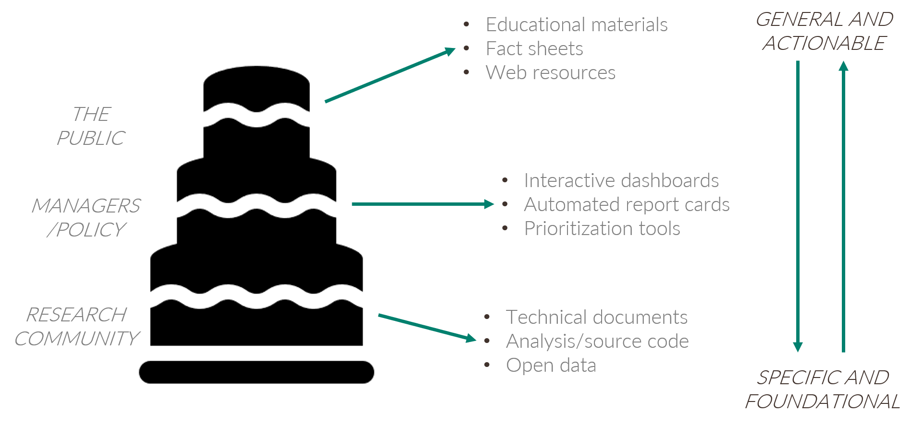

# Data Management Workflow {#workflow}

This section is in two parts, to first describe a workflow that we use internally at TBEP to manage our data in section \@ref(tbepapproach) and then to describe a road map for opening internal or external datasets at your own organization in section \@ref(howyou).  The first section expands on our philosophy for using open science to manage data, including specific workflows we use, as context to the second section.  Our approach is one way of applying open science to managing data.  Applying the same approach at your organization may or may not be appropriate depending on your internal and external needs for managing data.  As such, our approach is generalizable and modular - any of the approaches can be modified in part or together for your own needs. 

## The TBEP approach {#tbepapproach}

### An Open Science philosophy {#philo}

Sections \@ref(opengeneral) and \@ref(philogeneral) introduced you to our basic philosophy and approach to managing data at TBEP.  As an organization that facilitates science, management, and outreach activities among our local partners, we adopt open science as a cornerstore strategy that will serve the Program's core values.  This approach is made explicit in our [Strategic Plan](https://drive.google.com/file/d/11xohuoaHDxNHRqgXoOHdI37FpWvac_rn/view?usp=sharing) that describes how we achieve programmatic goals defined under our [Comprehensive Conservation and Management Plan (CCMP)](https://ccmp.tbep.org) and the partner commitments identified in our [Interlocal Agreement](https://drive.google.com/file/d/1iJcWxmc5SeyDTqiCQ3MLQGWEY_EDGtZT/view?usp=sharing) to help us achieve our goals. 

Our data [Quality Management Plan](https://drive.google.com/file/d/1DyA0PNHV8rEXGMwGiyS7sXY1ECLYpJJO/view) (QMP, @tbep1620) is a companion document to this SOP that ensures the data used by TBEP for decision-making has known and documented quality and is being used appropriately. The QMP establishes an internal process for verifying data quality standards that conform with the federal requirements our organization is subject to, as funded in part by federal dollars under Section 320 of the [Clean Water Act](https://www.epa.gov/laws-regulations/summary-clean-water-act).  Conversely, this SOP is a more hands-on and accessible document that describes a how-to approach for data management that we adopt as an organization.  The SOP goes beyond the QMP by exposing the process and ideas behind how we manage data at TBEP so that others can learn from our experience.  We encourage you to also view our QMP to understand the literal benchmark we use to ensure quality of our data.

We actively work to apply open science to every activity we pursue to achieve our goals under the CCMP.  Open science is a philosophy and set of tools to make research reproducible and transparent, in addition to having long-term value through effective data preservation, provenance and sharing [@Beck20].  We use a definition from the [Creative Commons](https://creativecommons.org/about/program-areas/open-science/) for open science as:

> Practicing science in such a way that others can collaborate and contribute, where research data, lab notes and other research processes are freely available, under terms that enable reuse, redistribution and reproduction of the research and its underlying data and methods.

There are several key words we can extract from the definition - collaborate, contribute, reuse, redistribute, and reproduce.  These concepts channel some of the ideas described by the FAIR principles (section \@ref(fair)).  We can further elaborate on these key words by defining open science as a set of four core principles (Dan Gezelter, <http://openscience.org/what-exactly-is-open-science/>. 

1. Transparency in experimental methods, observations, and collection of data.
1. Public availability and reusability of scientific data.
1. Public accessibility and transparency of scientific communication. 
1. The use of web-based tools to facilitate scientific collaboration and reproducibility.

Why is this so important?  Environmental science is very much in the business of applied science, meaning that research that is conducted to develop an understanding of the environment can be used to support the protection and management of a resource.  We need to understand a problem before we can  pursue actions that effectively adress it, especially if a wrong decision or action is costly.  Active and useful channels of communication must exist for the lessons learned from science to be applied to real world problems.  Applied science can be facilitated with open science to create these channels, and therby accelerate practical solutions. 

Without getting too much into the history of how insular practices among academics have contributed to closed science, it's useful to briefly discuss some of reasons why science may not be translated into action.  As a generalization, researchers are trained to study and document details.  Progress in science is based on: 1) an intimate understanding of details that guide process, and 2) convincing your peers through rigorous review that you actually understand the details you claim to understand.  As a result, we catalog progress in ways that are true to the scientific process, often as dense texts with every last detail noted.  Many researchers not being taught otherwise will often assume that this is an effective way to communicate scientific results to non-scientists.  What we don't realize is that those that need this information to make decisions do not communicate this way because they are not in the business of scientific discovery. Unless they have a personal interest, they don't care about the science behind the decision, only that the science is right to justify the decision.  The most ineffective approach for a scientist to inform environmental management is to deliver a dense 500 page report and assume it provides an effective vehicle for an environmental manager to make a rational decision.  This is not applied science - it is "implied science" because we implicitly decide that our conventional modes of scientific communication will influence management or policy. 

In addition to communication barriers, other challenges to applied science include irreproducible results, information loss, inaccessible data, and opaque workflows (section \@ref(whymanage), Figure \@ref(fig:divide)).  These challenges affect how science is delivered to decision-makers, how much trust a decision-maker can have in the science behind the decision, and how likely the science can be used as a springboard for additional scientific inquiry.  Effective data management as a subset of the broader principles of open science can help bridge the "research-management divide" and help develop continuity of scientific products that can benefit the larger research community.    

```{r divide, out.width = '80%', fig.cap = "Challenges to bridging the divide between scientific products created in research and informed decisions for environmental management.", fig.align = 'center', echo = F}
knitr::include_graphics('img/divide2.png')
```

### The open science cake

Truly applied science facilitated by open science principles allows for research results or data to connect with different audiences along a spectrum.  It allows research to be shared with other researchers, be connected with decision-makers, and be accessible to the general public.  Where an individual consumes scientific information along the spectrum depends on their interest, need, or level of background knowledge about a subject.  A solid technical foundation is a prerequisite for sharing information and open science methods allow various elements of the research foundation to be accessible to different end users.  We meet our audience where they're at, rather than assuming they can find their way to the details they need. 

We can describe this metaphor as the __open science cake__ (figure \@ref(fig:cake)).  We use this metaphor because everybody loves cake and it conveniently describes the TBEP philosophy to delivering science in an applied context.  This delicious layered cake is a gradient of information from top to bottom.  At the top, the information is more general (e.g., educational material for public consumption) or can be used to inform action (e.g., what needs to be done to remedy a problem).  At the bottom, the information has specificity and forms the foundation for generality or action at the upper layers.  The bottom of the cake is large, reflecting the decades of research and technical resources that are available to inform the management of Tampa Bay (e.g., our [library](http://tbep.org/library)).  The bottom also includes resources that can be used to springboard additional research, such as analysis code and source datasets.  Individuals at the top of the cake probably don't want a slice at the bottom, but the slice they take from the top would not exist without support from the bottom.

```{r cake, fig.cap = 'The open science cake showing the connection between research, environmental decisions, and the public.'}

```

Most of our partners are professionals from resource management or local government agencies that have some vested interest in the protection and restoration of Tampa Bay.  This is the primary audience that we can inform for decision-making.  Broadly speaking, this is the audience that needs distilled information from research products but with a level of specificity that goes beyond educational materials.  These individuals are in the middle of the cake and the slices they take are actionable science products, such as interactive dashboards, automated report cards, and other decision support tools.  The middle part of the cake is where conventional science becomes truly applied science.

The cake also emphasizes a vertical connection among the layers that allows an individual to take a slice as high or as low in the cake as they want.  This is a critical principle of open science that speaks to accessibility of information at all levels of the scientific process.  Most of the time, an individual will take a slice from the cake at the level that's appropriate for their needs.  However, we want our science (and data) to be transparent and accessible under the FAIR principles and someone can take a slice at a different level, if they have a need to do so.  This also speaks to developing a community of practice for open science - we develop this community to provide easier access to the tools at the bottom of the cake and develop the ability to use them to reproduce or expand on existing products at all levels.  

Our web products on the [data visualization](https://tbep.org/our-work/data-vizualization/) section of our web page are designed to guide an individual to the slices they need at the different levels of the cake.  The website is setup as a series of cards (cakes) for each reporting product that act as an entryway (top of the cake) to the middle and bottom layers of each cake.  For example, if someone clicks on the [Water Quality Report Card](https://tbep.org/water-quality-report-card/), they are directed to a web page that has very general information about the reporting product and links to a [summary pdf](https://drive.google.com/file/d/124FXmLcXKYUf3ktaVOvFejndiPS0m7K7/view?usp=sharing) that distills over forty years of water quality data for the Bay.  There are links on the right side of the page that provide access to the building blocks of the report card, including the online dashboard, source code for the report card, build status of the report (more on this in section \@ref(automation)), citable DOI, and technical documents that describe the science behind our water quality assessment approach.  These links provide the path to the lower levels of the cake.    

### How do we build the cake? {#automation}

The cake is a useful metaphor to describe how we apply open science to achieve applied science, but how is this done in practice?  How are the layers of the cake actually linked to one another?  We use several open source programming tools to link source data to reporting products, with the goal of producing the most timely information for decision-makers with minimal overhead by internal staff.  In this section, we describe these tools and how we link them together to create a workflow that is both automated and reproducible.

The workflow we use to link source data to reporting products for our [annual water quality assessment](https://tbep.org/water-quality-report-card/) is shown in figure \@ref(fig:osworkflow). The process begins by accessing an external data source from our partners.  In this case, this workflow accesses a spreadsheet of water quality data on an [FTP site](ftp://ftp.epchc.org/EPC_ERM_FTP/WQM_Reports/) maintained by the Environmental Protection Commission of Hillsborough County (EPC).  These data are processed using custom-built software developed by TBEP staff and with a suite of more general open source tools, including R, RStudio, relevant data wrangling packages, and tools for document preparation.  The open source tools we've created are also hosted online on [GitHub](https://github.com/tbep-tech) which serves two goals.  First, providing the tools on GitHub makes them discoverable and accessible to others. Second, they are integrated into an automated process to make sure the most current data are used for reporting. Once the build process for the report card is done, the final products are shared as a Shiny web application for additional inquiry and discovery, and our two-page PDF report are hosted on the TBEP website for general dissemination.

```{r osworkflow, fig.cap = 'The TBEP open science workflow connecting source data to decision-support tools.'}
knitr::include_graphics('img/os-workflow.png')
```

The core component of this entire workflow is the [tbeptools R package](https://tbep-tech.github.io/tbeptools/) [@Beck21].  This software was developed using the [R programming language](https://cran.r-project.org/) to read, analyze, and visualize data that we use to report on progress in achieving CCMP goals.  Most of the data tools on our web page depend on functions within the tbeptools package to work with the raw data provided from our partners. Although tbeptools is primarily used by TBEP staff, the package is provided free of use (under the [MIT license](https://tldrlegal.com/license/mit-license)) for anyone interested in exploring the data on their own.  Importantly, all source code is available on GitHub so that anyone with an interest can understand exactly what is done to process the data we use for reporting.  This is a very literal definition of method transparency.  

There are several functions in the tbeptools package that are built specifically for reporting on water quality, all of which are explained in detail in the [introduction vignette](https://tbep-tech.github.io/tbeptools/articles/intro.html) for the tbeptools package. A "vignette" in the R world is a plain language document that explains how to use functions in a package.  Currently, the tbeptools package includes five vignettes, one for each indicator that has reporting functions available in the package:

* [Intro to TBEP tools](https://tbep-tech.github.io/tbeptools/articles/intro.html): A general overview of the package with specific examples of functions for working with the water quality report card.
* [Tampa Bay Nekton Index](https://tbep-tech.github.io/tbeptools/articles/tbni.html): An overview of functions to import, analyze, and plot results for the Tampa Bay Nekton Index.
* [Tampa Bay Benthic Index](https://tbep-tech.github.io/tbeptools/articles/tbbi.html): An overview of functions to import, analyze, and plot results for the Tampa Bay Benthic Index.
* [Tidal Creeks Assessment](https://tbep-tech.github.io/tbeptools/articles/tidalcreeks.html): An overview of functions to import, analyze, and plot results for the assessment of tidal creeks in southwest Florida.
* [Seagrass Transect Data](https://tbep-tech.github.io/tbeptools/articles/seagrasstransect.html): An overview of functions to import, analyze, and plot results for the seagrass transect data collected in Tampa Bay.

Each vignette is set up similarly by explaining the functions used to read, analyze, and visualize the data.  In fact, every function name in the package is named with an appropriate prefix for what it does, e.g., `read_transect()` reads seagrass transect data, `anlz_transectave()` analyzes annual averages of seagrass frequency occurrence, and `show_transect()` shows a plot of the transect data.  The examples in the vignette further explain how to use the functions and what each function does when working with the data.  

The functions in tbeptools used to read data into R were all built to ensure the most recent data are used for analysis.  Each data import function follows a decision tree shown in figure \@ref(fig:readchk), where a set of internal checks are used to see if the data are available on your computer, compare the data to the online source, and download the most recent version if a local file doesn't exist or your current file is out of date.  This process also ensures that any downstream reporting products are using the most current data.  For example, the web page for [water quality assessment](https://tbep.org/water-quality-report-card/) has a provisional report card that is based on the most recent water quality data available from EPC.  Although the "official" report card is published at the beginning of each year, provisional data throughout the year can be used to assess water quality changes in near real time.

```{r readchk, out.width = '80%', echo = F, fig.cap = "Internal checks used by the tbeptools R package to ensure the most current data are used for analysis."}
knitr::include_graphics('img/readchk.png')
```

The workflows we've created that access source data to create reporting products depend on data being online in a stable location.  This underlies the importance of proper data management practices.  We cannot create and use the reporting products without a findable and accessible location for the source data.  The data we use for our various indicators are distributed at different locations depending on who maintains the information.  This includes a mix of FTP sites, Microsoft Access databases, JSON files, or geospatial data hosted through third party websites.  The various locations, data formats, and depths of available metadata are a potential concern for long-term viability of these workflows.  A majority of the locations where these data are found are not formal data archives or repositories and there are not any "official" standards for how these data are made available.  Because of this, a long-term goal for TBEP and our partners is to work towards a shared data management infrastructure that more closely follows the FAIR principles.

A critical part of the workflow in figure \@ref(fig:osworkflow) is automation.  We have developed the functions in the tbeptools package with this in mind, i.e., making sure the most up to date data are used without having to manually download the data.  We also leverage continuous integration/continuous deployment (CI/CD) services through GitHub that automate our workflows.  CI/CD simply means that we've setup automated checks and processes based on different triggers that happen when we do something to a project that we've put on GitHub.  For example, every time we push (upload) a change that we've made on a local version (i.e., on a personal computer) of tbeptools to the main repository on GitHub, a set of automated checks are used to make sure we didn't break anything in the package.  The "badges" you see on GitHub and in the data visualization section of the TBEP website indicate if the checks were successful or not.  These badges are small indicator icons that are shown as green (checks passing), red (checks failing), or grey (no information).  They are often included in GitHub repositories and can also be linked on other websites.  These provide a quick scan of whether or not you should expect the package to work as intended if you download it from its current state in the repository.   

Many of the README files for the different GitHub projects we maintain include one or more badges that indicate if our data products are working as we hope.  For example, the README file for our tbeptools R package includes three badges that indicate the status of different CI/CD processes (figure \@ref(fig:badges)).  The first badge, R-CMD-Check, shows if the set of standard checks for R packages are passing.  There are dozens of checks for R packages, including things like making sure the documentation is up-to-date, file sizes aren't excessive, the file structure is setup correctly, the examples run without errors, etc. (see [chapter 19](https://r-pkgs.org/r-cmd-check.html) in @Wickham15 for a full description of these checks).  The second "pkgdown" badge shows if the [website](https://tbep-tech.github.io/tbeptools/) for the package (built with the R pkgdown package; @Wickham20) has been successfully built with the last change to the repository, i.e., does information on the website reflect the package in its current state?  Finally, the "codecov" badge provides a general estimate of how much code in the package includes unit tests as part of best practices for software development. In this case, nearly all of the code (92\%) is tested in one form or another.

```{r badges, echo = F, fig.cap = 'An example of the status badges included in the README file for the tbeptools R package.'}
knitr::include_graphics('img/badges.PNG')
```

The CI/CD workflows are completely customizable to suit the needs of a given project. The badges in the previous example simply indicate if the CI/CD checks for a package and its website are working correctly.  These are often included in README files to give users peace of mind that our development processes are following accepted standards in the broader open source community.  Other badges can indicate if a custom workflow is up to date, such as for our automated reporting products.  The water quality report card has a provisional draft that uses the most recent dataset from EPC.  The CI/CD process is setup to rebuild the pdf by running a custom "build" file that imports the data, analyzes the results, and creates the plots, all using function from tbeptools. The output graphics are embedded in a type of document preparation system that mixes plain text and code to dynamically generate a static pdf.  All of this is accomplished in the build file, which is triggered daily through the CI/CD services on GitHub.  The CI/CD badge for this repository indicates if the daily build was run and if the provisional pdf was successfully created.  Many of our reporting products leverage these services and you can view the status of each product from the badges we've placed on our main TBEP website or on the README file for specific GitHub repositories. 

### More on Git and GitHub {#moregit}

GitHub is a foundational tool that is central to our data management workflow.  We've described how it can be used as an intermediate solution for hosting data (section \@ref(datahome)) and how we use it to share and automate our reporting workflows (section \@ref(automation)).  Our use of GitHub aligns with our broader philosophy of using open science and here we explain some more general concepts about what GitHub can provide to our community to emphasize the value it can have for data management. 

Many people describe Git and GitHub synonymously, but we need to distinguish between the two to develop an understanding of the different services each provides.  First, Git is a formal version control software, whereas GitHub is an online platform for sharing code that uses Git.  It's possible to use Git without using GitHub (i.e., using version control only on your personal computer) and it's possible to use GitHub without using Git (e.g, using GitHub to share a file).  Naturally, using both Git and GitHub together can help leverage the benefits of each. The relationship between the two is very similar to that of R and RStudio.  Using R by itself is okay, but the value to yourself and others of using RStudio as a vehicle for R will be greatly enhanced.   

Version control is a way to track the development history of a project.  It serves the joint purposes of: 1) formally documenting the changes that have been made to code or software, and 2) making sure that the development history is permanent.  Documenting changes provides a transparent record for yourself and others, and establishing permanency ensures that any of the changes that are made can be vetted and accessed as needed. Using Git is extra work, but when you need it you'll be glad you've invested your time wisely.  Think of an instance where you've saved different versions of a file with different names because you don't want to delete any of your old work.  You end up with many extra files and no clear way to understand the origins or connections between the files. Git takes care of this for you by providing a navigable insurance plan for your project. 

GitHub lets you share your files or code under Git version control in an online environment so that you and your collaborators can more easily work together. You can host multiple projects under version control, view the entire history of each project, and allow others to more easily work asynchronously and together on the same project.  GitHub also has tools for tracking "issues" associated with different projects, providing a simple way to document questions, bug fixes, or enhancements.  GitHub is a near perfect example of open source in practice.  Anyone can view and potentially contribute to other people's projects using a platform that ensures everything is fully documented and never erased.

GitHub also includes a variety of other tools that facilitate openness: 

* Release tagging to assign formal version numbers to code, data or software. 
* GitHub actions to create your own CI/CD workflows (our examples in section \@ref(automation) use these tools).
* Integration with [Zenodo](https://zenodo.org/) for DOI assignments to give your project a stable and permanent address.  You can see these links on many of our projects on GitHub (e.g., our [water quality dashboard](https://github.com/tbep-tech/wq-dash)).  
* Website hosting, as for our [tbeptools](https://tbep-tech.github.io/tbeptools/) R package.
* Attaching licenses to a project with visible links to the usages defined under each license.

All of this may sound very specific to software development, but GitHub can take you a long way towards adopting FAIR principles through better data management practices.  The concepts that apply to version control for code and software have parallels for data management and many of the features to facilitate openness in GitHub can also apply to data. Making your data accessible, documenting the changes you've made over time, and establishing a permanent home (e.g., through Zenodo) can all be done with GitHub.  We elaborate on a case study example using GitHub for data management in section \@ref(twitter). 

GitHub also lowers the barrier to inclusion for engaging others in a project.  Unless you work with a dedicated team of software or web developers, it's very rare that your colleagues will have experience with Git or even know what it is (although this may be less common in the future).  This doesn't mean that others are excluded from contributing.  For example, anyone can post issues for a project through the simple web interface provided by GitHub.  Changes to source documents can also be made online that can be tracked through version control without having to use Git on your own (e.g., see our contributing guidelines for this document in section \@ref(contrib)).  

The TBEP has a [group GitHub page](https://github.com/tbep-tech) where all of our projects exist, including the source content for this SOP. We do this for all of the reasons mentioned above and as an attempt to serve as an example of how open sharing can lead to better science in less time [@Lowndes17]. Anyone can view our pages to understand the source code, see the changes we've made over time, and post issues/edit content to directly contribute.  This has immense value for how we collectively work as a team and with our partners outside of TBEP. 

### Use of artificial intelligence {#aiuse}

Applications that use artificial intelligence (AI) to generate seemingly novel content have received increased attention for their potential to improve, support, or even replace workflows.  How these tools can be used or misused to support open science applications is worth discussing.  The [ChatGPT](https://chat.openai.com/){target="_blank"} interface provided by the OpenAI research organization, as well as other emerging interfaces, can be leveraged to support open science, in addition to supporting countless other applications.  It's important to understand the advantages of these tools, while respecting their limitations and potential for misuse.      

"Artificial intelligence" (AI) is a generic term that the public and private spheres use loosely, much like "big data" was a buzzword a few years ago.  AI doesn't describe a specific method or tool, but rather the collective body of research and applications focused on using computers to mimic human logic and reasoning.  What makes ChatGPT notable among other AI applications is its ability to produce text-based content that reads like it was written by a human.  This content is created based on a user prompt, such as a question or request. The response is, in all practicality, informed by all of the information on the internet. 

You might ask ChatGPT the following: 

```
How can artificial intelligence improve my life? 
```

In a few seconds, you'll get a response to your question.  

```
Artificial Intelligence (AI) has the potential to improve various
aspects of your life in several ways. Here are some ways AI can 
enhance your daily life and overall well-being:

1. Personal Assistants: AI-powered personal assistants like Siri, 
Alexa, or Google Assistant can simplify your daily tasks. They can 
set reminders, answer questions, provide weather updates, and 
control smart home devices, making your life more convenient.

2. Healthcare: AI can assist in early disease detection, aid in 
medical diagnoses, and improve treatment planning. For example, 
AI-driven medical imaging can help detect diseases like cancer, 
while wearable health devices can monitor your vital signs and 
provide real-time health insights.

etc.
```

And so on - the answer continues with a few more examples.  It's apparent that the text goes well beyond the information you might get from a standard search engine. You can even ask generative AI technologies to create novel text for you, not just providing answers to questions.  For example, you might ask ChatGPT to write a cover letter for you based on job application information copied/pasted in your prompt.  The answer you receive will be highly tailored to the content contained in your prompt. 

It may seem like these new technologies are achieving the holy grail of AI research, but the underlying models are not fundamentally different than any other predictive tool used in conventional statistics.  For example, ChatGPT uses a "large language model", which is fancy speak for a predictive model that is based on "learned" associations between words and grammar rules.  By evaluating millions of lines of online text, certain words are found to be more likely associated with one another, e.g., "red ball" as compared to "red newspaper".  Even grammar rules can be identified as emergent properties from text, so words that commonly appear together can be combined into sentences and even whole paragraphs.  The response returned by a prompt is simply the best guess provided by the model of what is the most likely answer to your query.  These models are not new - what's new is the computational power to train the models on very, very large datasets.  

Most, if not all, generative AI technologies are not perfect and it's guaranteed that you will receive incorrect answers to questions.  The answers will only be correct in so much as the information the technologies rely upon is correct, which of course is a risky assumption when some of the models rely on internet sources.  Therefore, interpreting answers from AI services like ChatGPT should be done with extreme caution.  A more dangerous application is claiming its services as your own, such as the example above describing how to use ChatGPT to write a cover letter.  This content is not a reflection of your abilities and using it in professional or acedemic settings could be considered plagiarism, in addition to risking your career.  

Dismissing generative AI as an immoral application that provides incorrect information would completely ignore its potential to enhance your own workflows. In reality, most of the information provided by these technologies is reasonably correct and most users are probably not applying it for nefarious purposes. Simply being aware of these caveats is requisite to its use. As such, the following describes how the TBEP is using one generative AI technology (ChatGPT) to enhance our open science workflows without irresponsible application beyond its limitations.  

ChatGPT is an outstanding resource for computer coding, particularly for open-source applications like R, where millions of lines of code are readily available for training generative AI.  Further, identifying incorrect or inaccurate answers to code-based questions is much simpler than for answers to knowledge-based prompts that mimic human linguistics.  The code works or it doesn't.  As such, the TBEP is currently using ChatGPT to assist with coding to support the dozens of open science applications used by the program.  Many of these activities are considered routine and require minimal thought by the programmer, thereby freeing time to focus on more thoughtful coding applications. These activities are summarized below. 

1. __Developing code templates__: Creating templates to begin more comprehensive applications, such as initial code for a plot or Shiny application. 
1. __Assisting with package development__: Many aspects of package development are routine, such as writing code documentation or unit tests. Entire functions can be copied/pasted into a prompt for a request to generate supporting information.  All answers are thoroughly reviewed for accuracy and verified they work as intended before use in a package.
1. __Migration of legacy code__: ChatGPT is extremely adept at converting code between programming languages. Legacy code created by TBEP and its partners (e.g., SAS routines) have been converted to R code using ChatGPT for inclusion in open science workflows.  Typically, the converted code includes bugs and time is needed to identify potential errors and to ensure the expected results are accurate.  However, this time is minimal compared to manual transcription of legacy code.
1. __Web requests__: Many TBEP applications rely on web resources (i.e., APIs) to retrieve partner data or other external datasets that support indicator reporting and routine assessments.  These resources often provide instructions for retrieving data that require conversion into programming languages used by TBEP.  Asking ChatGPT to format these requests into R code has been helpful for creating "evergreen" products that maintain seamless links between source data and outputs.   
1. __Asking simple questions or to assist with debugging__: ChatGPT often returns more accessible and efficient solutions to common coding questions than those provided by more conventional internet queries to a search engine.  In this way, ChatGPT is often used as a replacement or alternative source of information to other coding support platforms, like [StackOverflow](https://stackoverflow.com/){target="_blank"}. 

Many of the above examples require copying/pasting of sample code or datasets into ChatGPT prompts.  One very important caveat of doing so is realizing that information used in prompts are now canon and part of the entire training database used by ChatGPT.  Personally identifiable information or otherwise sensitive data should never be used in prompts.  Placeholder text (e.g., anonymizing data) or providing snippets of datasets in code prompts would be appropriate.  For the latter, simply defining the column names and data types in each column is often sufficient to receive a useful answer from ChatGPT.  The `glimpse()` function from the [tibble](https://tibble.tidyverse.org/){target="_blank"} package can be used to return this information without showing any of the actual data (e.g., `glimpse(epcdata, 0)`, note the "0" argument): 

```
Write me some R code for plotting some of the continuous variables
against SampleTime:

Rows: 27,601
Columns: 26
$ bay_segment            <chr> …
$ epchc_station          <dbl> …
$ SampleTime             <dttm> …
$ yr                     <dbl> …
$ mo                     <dbl> …
$ Latitude               <dbl> …
$ Longitude              <dbl> …
$ Total_Depth_m          <dbl> …
$ Sample_Depth_m         <dbl> …
$ tn                     <dbl> …
$ tn_q                   <chr> …
$ sd_m                   <dbl> …
$ sd_raw_m               <dbl> …
$ sd_q                   <chr> …
$ chla                   <dbl> …
$ chla_q                 <chr> …
$ Sal_Top_ppth           <dbl> …
$ Sal_Mid_ppth           <dbl> …
$ Sal_Bottom_ppth        <dbl> …
$ Temp_Water_Top_degC    <dbl> …
$ Temp_Water_Mid_degC    <dbl> …
$ Temp_Water_Bottom_degC <dbl> …
$ `Turbidity_JTU-NTU`    <chr> …
$ Turbidity_Q            <chr> …
$ Color_345_F45_PCU      <chr> …
$ Color_345_F45_Q        <chr> …
```

AI for non-coding purposes is also being applied by TBEP.  As before, these applications are meant to support and not replace the work done by humans.  All content produced by generative AI technologies are carefully reviewed before their use in any publicly facing materials.  Below are some more general applications of AI technologies used by TBEP:

1. __Distillation of information__: Technical reports have been summarized into manageable short text for communication to the management conference or partner agencies.  Specific prompts are provided regarding the type of information requested from the document so that key concepts and ideas are communicated accurately.
1. __Generation of social media content__: Generative AI can be used to create text content in the style appropriate for social media applications. Content can be generated based on the requirement of each social media application, e.g., limiting the output to character length requirements and for the intended audience. 

Many worry that generative AI technologies will outcompete humans for their jobs, particularly in the tech industry.  This fear is unfounded (at least not at this time) - as these technologies are not a replacement for a programmer with years of experience.  Although it's true you can quickly get usable code through a simple request, this doesn't mean you'll understand everything the code does if you don't know the language.  More importantly, it also means that you won't be able to debug or easily modify the code for your own use.  For example, most code returned by ChatGPT includes generic placeholders or object names that require modification, preventing the code from running in isolation.  The code may also simply include incorrect information. Further, generative AI can sometimes create packages or function names that have never existed.  These issues will be very difficult to diagnose without prior experience.  The more important question you should be asking is how you can benefit from the positive aspects of the technology to simplify your existing workflows.

Tools like ChatGPT continue to evolve and how TBEP, as well as the broader scientific and management communities, engage with them will also change.  This will require thorough understanding of their limitations and pitfalls before they can be used responsibly.  Moral and ethical implications aside, these tools are here to stay and the responsibility of understanding how best to leverage these applications to improve efficiency in creating open science applications is paramount.   

## How can you manage data? {#howyou}

This section is written as a road map for managing a data product, keeping in mind the list of tools and resources in section \@ref(tbepapproach) that can be used along the way to develop the product.  These tools can help you at different stages of the data management process to help build the layers of the open science cake. The guidance provided by @Goodman14 and @Michener15 are also excellent resources presented as "simple rules" for working with data.  @Goodman14 develops a metaphor of data as a living entity by describing rules for the care and feeding of scientific data. @Michener15 focuses on rules for developing a data management plan.  Many of the concepts and tools presented herein are elaborated upon in these two resources.    

A road map to developing a plan and set of tools for delivering a data product is shown in figure \@ref(fig:dataworkflow).  This map is presented as a hypothetical one-year project from beginning to end, but it can be applied to a project of any duration. The steps are separated along a general timeline with a notable distinction between steps occurring before and after data collection.  It's also very important to realize that "data collection" can have a literal interpretation as collecting data in the field or during an experiment, whereas collection can also be considered generically as the process of creating less conventional data products (e.g., workflows, modelling output/information, decision-support tools, section \@ref(contribs)).

```{r dataworkflow, fig.cap = 'A hypothetical and generalized timeline for managing data associated with a project.', out.width = '100%'}
knitr::include_graphics('img/dataworkflow.png')
```

There are five general steps in the road map.  Where you're at in the project determines what conversation you're having with yourself and your research team about managing the data product.  At the beginning of a project in Step 1, goals and objectives are defined, potential data contributions are identified, and metadata concepts are introduced. Step 2 is developing the data framework, meaning you will identify how your data are structured within the goals of the project.  Here you are thinking about data dictionaries or workflows you will use to generate the data product.  In Step 3, you are actively collecting and curating data in a way that conforms to the framework you've developed.  This step is iterative because it is where most of the work happens and you may need to rethink some of the ideas around data curation based on how the collection process works in reality.  Steps 4 and 5 focus on identifying where the data are going to be maintained/stored and finally delivering the data at that location.  

The road map in figure \@ref(fig:dataworkflow) can be used in parallel with other project timelines, such as those included in a scope of work.  It is a separate but complementary approach that focuses specifically on data, as compared to other details associated with a research project (e.g., budget, field work, etc.).  The road map also emphasizes that researchers should be proactive in thinking about their data deliverables, particularly regarding important contributions, appropriate formats, metadata concepts, and conformity with this TBEP SOP. The earlier these conversations happen in a project, the easier it will be to deliver a well-documented data product. 

A researcher or research team will benefit most by using this road map from the inception of a project, although we realize that this may not be the norm and data curation is routinely considered an afterthought.  For this reason, we present the following sections as a guide to using this road map at any stage of the research process.  

### I'm at the beginning of my project {#beginning}

In an ideal scenario, you are actively thinking about a plan for delivering your data product at the beginning of a research project.  Data are the foundation of the project and discussing how you will work with it at the beginning will ensure that the foundation is on solid ground moving forward. Starting the conversation early can also normalize ideas about the importance of paying close attention to data curation.  Data are often poorly managed because the value of proper data management to the individual or an organization may not be apparent.  These values are also not immediately obvious unless you've spent a lot of time working with other people's data. This includes conversations about the value of metadata.  Discussing these details at the beginning of a project will establish a culture of stewardship that is parallel to the larger research process.

Appropriate questions to answer at the beginning and early phases of a project (steps 1 and 2, figure \@ref(fig:dataworkflow)) can include the following.

> What type of project am I working on and what products can I expect? 

The answer to these questions could be based on the intended audience for results that are produced by this research.  If your project will have results that can be applied to address some real-world issue, than you are likely working on a project that can deliver a data product to inform decision-making.  Think about an appropriate format for this data product that will best meet the needs of your audience.

> Which datasets are important? 

The answers to the previous questions define your answer to this question.  However, it's a rare scenario when you only have one data product as the primary contribution from a project.  Early conversations about which data products will be the focus of curation are necessary at this stage.  Guidance for determining which datasets are important are expressed in detail in section \@ref(contribs).

> How do I want to make the data accessible?

Data typically won't be made accessible until the end of a project, but knowing where your data will live can help identify what tools you need to use along the way to deliver the product.  This includes identifying an appropriate metadata format, analysis platforms to work with the data, and formats that are supported by the location where you're going to keep the data.  Having clear answers to these questions will save you the most time at the end of a project.

> What QA protocols should be established?

Developing a plan for using the [FAIR](#fair) principles with your data is just as important as ensuring the data have adequate quality for use by you and others.  At the beginning of a project, start actively developing a data management plan that defines appropriate methods for collecting the data and verifying its quality.  Guidelines in @Michener15 can help with this process or you can use the online [Data Management Plan tool](https://dmptool.org/). 

### I'm somewhere in the middle of my project {#middleproject}

In a less ideal scenario, you are somewhere in the middle of your project and are just now thinking about types of data products and the path you'll take for their delivery at the end of the project.  At this stage, you'll need to retrofit some answers to the questions in the last section to identify important data contributions, how you'll make them accessible, and how you'll collect and format the data to ensure adequate quality.  It will be easier to answer these questions if you have yet to collect any data.  However, you will need to make sure that you and your research team understand the value of data curation since now it will be seen more as an afterthought that was not discussed at the beginning of the project.  You will need to put in some extra work to normalize conversations around data management and why doing so is important.

If you have already collected data, you'll need to take some time to evaluate how you're collecting this information so that it addresses the answers to questions in section \@ref(beginning).  If you're collecting tabular data, make sure you are using a tidy data format (section \@ref(whytidy)) and that you have developed an appropriate data dictionary (section \@ref(dict)) to put some boundaries on how the information is stored.  At this stage, it may be impractical and unreasonable to ask field or lab staff to enter their data differently and developing a *post hoc* workflow to wrangle your data into a tidy format may be the best option.  Identifying appropriate keys for your data is also critical at this stage. If your data product is more general (e.g., analysis workflow, decision-support tool), make sure you can trace the provenance of these products to their conception.  What inputs did you use to create this resource?  If you built it from scratch, what tools are you using to build the product (e.g., software and versions)?  You may need to do a bit of detective work to identify answers to these questions. 

For metadata, the same rules apply in the middle of a project as those at the beginning of a project.  First, identify where you plan on delivering and hosting your data and work backwards from there.  If the location has a specific metadata standard, identify the information you'll need to conform to that standard.  If you plan on hosting your data at a more general location, start collecting answers to the "who", "what", "when", "where", and "how" questions for your data.  The most important part of this process is understanding that metadata documentation should start as soon as you realize that you have not been doing so.  The longer you wait, the more likely it is that you'll be unable to track down information or you'll simply forget important details about a dataset. 

### I'm at the end of my project {#endproject}

Prepare yourself for damage control if you're at the end of your project and have yet to think about data management.  You not only have to make some judgment calls on the most important contribution, but you also have to begin the laborious process of finding and extracting intimate details about that contribution.  The temptation to identify low-hanging fruit that are easy to document but may not be the most important contribution is very real and you should avoid doing this to not undersell the potential impact of a project. Putting in the time to backlog the provenance of a more important contribution should be an investment that will have more pay off in the future than documenting an intermediate or less relevant data product.  The most important question to answer at this stage is what is the most anticipated and impactful result of this research project and what dataset delivers this result?  

In the real world, most researchers discuss delivery of a data product at the end of a project because nobody wants to do this at the beginning when more interesting and creative problems about a project are the center of discussion. Of course this is not ideal, but we want to encourage you not to feel overwhelmed and not to give up at this stage.  We presented a lot of information about data management so far, but you should not feel that you need to do it all.  As before, something is absolutely better than nothing and giving up because you are overwhelmed to do "all the things" should not be a deterrent.  Open science and data management is incremental and, in reality, very few individuals will be able to complete all of the checklists without years of experience and substantial help from others. So, pick one thing off the list and use that as a starting point to building your comfort and skills in adopting better data management practices (spoiler: it should be metadata).   

### Metadata workflow

We described general metadata concepts in section \@ref(metadata), but did not provide a workflow for creating or generating metadata.  The process begins by answering the general questions we presented as a summary of those in the [Metadata in "plain language"](https://prd-wret.s3.us-west-2.amazonaws.com/assets/palladium/production/atoms/files/Metadata%20in%20Plain%20Language_508compliant.pdf) document.  Just start by writing the answers down in a simple text file or even as a spreadsheet with columns for each question.  Where the answers to these questions go depends on how formalized you want to make your metadata, which also depends on where you want to make your data accessible.  More informal storage approaches (e.g., GitHub, FTP site) could store metadata as a text file (e.g., in a README document), whereas storing your data in a formal repository would require you to choose an appropriate metadata standard (e.g., EML in section \@ref(eml)). Custom workflows that combine metadata documentation through an online user interface can also be created if you or your team have the capacity to do so [@Jones07].

The following can be used as a generalized workflow for metadata generation, ideally at the beginning of a project.  How far you go in these steps depends on where you want to store your metadata. 

1. Identify which dataset(s) are important contributions of a project that you intend on sharing and that need metadata (see section \@ref(contribs)). 
1. Draft a general document to answer the "who", "what", "when", "where", "why", and "how" questions in section \@ref(metadata) for each data product.  This can be a simple text file that "accompanies" each data product. A spreadsheet entry form can also be useful so that the metadata are in tabular format.  If it's tidy, this can be used to import into a program for converting your metadata into a formal standard or for uploading to a data repository.
1. Convert the metadata document into an appropriate file format based on the metadata standard you're using. For EML metadata, this would be an XML file.

This workflow is a starting point for creating simple to more complex metadata. For a hypothetical example, the absolute bare minimum for metadata might look like this (e.g., in a spreadsheet):

```{r, echo = F}
tmp <- read.csv('data/metadataex.csv')
pander::pander(tmp)
```

If we wanted to add some specificity, we could create separate fields to include more detailed information.  

```{r, echo = F}
tmp <- read.csv('data/metadataex2.csv')
pander::pander(tmp)
```

Finally, if we wanted to convert this information to an EML metadata file, we can use some tools in the [EML R package](https://docs.ropensci.org/EML/).  This example includes all of the information from the last example, but using specific tags and entry methods for the EML format,  The methods information can also be entered as a separate file for more long-form documentation (i.e., `set_methods('data/methods.docx')`). After the file is written with `write_eml()`, it can be validated for accuracy and completeness with `eml_validate()`.  The finished metadata file can be viewed [here](data/my_eml.xml). 

```{r, echo = T, warning = F, message = F, results = 'hide'}
library(EML)

# enter the metadata
me <- list(
  individualName = list(givenName = 'Marcus', surName = 'Beck'), 
  electronicMailAddress = 'fakeaddress@email.com'
)
title <- 'Water Quality Assessment Data'
coverage <- set_coverage(
  begin = '2020-01-01', 
  end = '2020-12-31',
  geographicDescription = 'Tampa Bay, Florida, USA',
  west = -82.8, east = -82.3, 
  north = 28, south = 27.4)
methods <- set_methods('data/methods.docx')

# combine the metadata
my_eml <- eml$eml(
  packageId = uuid::UUIDgenerate(),  
  system = "uuid",
  dataset = eml$dataset(
    title = title,
    creator = me,
    contact = me,
    coverage = coverage, 
    methods = methods
  )
)

# write and validate the file
write_eml(my_eml, 'data/my_eml.xml')
eml_validate('data/my_eml.xml')
```

There are many more attributes that can be included in EML metadata.  For example, we discussed the importance of a data dictionary in section \@ref(dict).  This information can be documented in an EML file in different ways and we encourage you to view the EML [website](https://docs.ropensci.org/EML/) for a full overview.  

The intent of presenting this example was to demonstrate simple to more complex approaches that you can use to create metadata.  However, it's also worth pointing out that this process can be completely operationalized through the workflows described in section \@ref(automation). It would be entirely conceivable to use a spreadsheet or web form entry to collect attributes for the EML file, import that information in R, and create the file with the EML R package.  This can be automated through a CI/CD build process on GitHub, where a user would only have to enter data on a web form and the rest can be handled through a routine created in R that is executed on GitHub.  Moving towards this approach to document and create metadata would be a tremendous leap forward in curating data products that are used by TBEP and its partners. 

### Let's get it online!

The previous sections on sharing data have covered general topics on where data could live (section \@ref(datahome)) and some options of how we do this at TBEP (section \@ref(moregit)).  These motivating examples are provided as a set of options, from simple to more complex, depending on how detailed and permanent you want to make your data.  Your data are less likely to be orphaned when more time is invested in documenting metadata and if you choose a location that is legitimately setup for archiving (e.g., DataOne).  The options we presented can be used to achieve these goals with varying success and it's your perogative on which option is most appropriate given the time you have to dedicate to data management, the objectives you have in doing so, and the ultimate requirements specified in a particular project agreement.    

We have not provided step-by-step details on how to deliver a data product online and we leave this exercise up to you.  In most cases, getting a dataset online is straightforward but the ease of doing so depends on where you want to put the data.  For simple solutions, such as FTP hosting or putting a dataset on Google Drive, all you need to do is upload the data by hand or use an existing file transfer service (e.g., [PuTTy](https://www.putty.org/)).  Of course, make sure you also upload any metadata and make it clear that your metadata accompanies the file you uploaded.  Hosting data on GitHub can be done using a command line interface (such as Git Bash) or as a GUI through [GitHub Desktop](https://desktop.github.com/).  Tools available in [RStudio](https://happygitwithr.com/rstudio-git-github.html) can also be used to host projects on GitHub.  

For more involved hosting platforms, data can also be uploaded through an online web interface.  For example, data can be uploaded by hand to the [knb](https://knb.ecoinformatics.org/) node of [DataOne](https://www.dataone.org/) in a web browser, including entry of metadata to generate the EML file.  However, open source tools can also be used to link directly to these services to build an integrated data delivery pipeline to avoid uploading information manually.  In addition to the [EML](https://docs.ropensci.org/EML/) R package, the [metajam](https://nceas.github.io/metajam/) package can access repositories on DataOne using R.  Many of these packages are under active development and the services they provide to access federated data repositories is expected to improve over time. 
