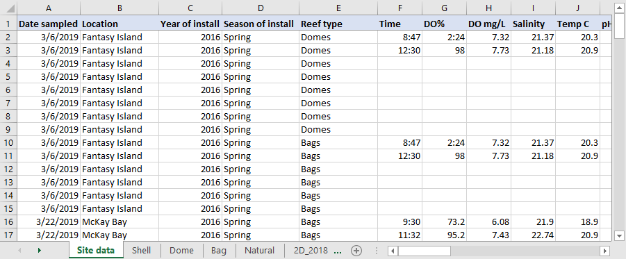
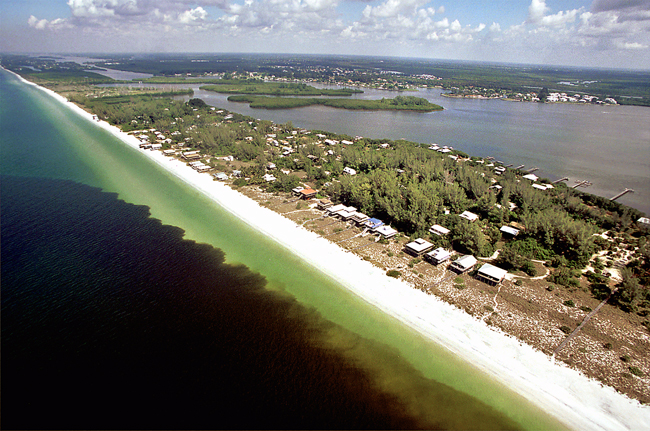

# Case Studies {#cases}

```{r}
library(dplyr)
load(file = url('https://github.com/tbep-tech/tberf-oyster/raw/main/data/oysdat.RData'))
load(file = url('https://github.com/tbep-tech/tberf-oyster/raw/main/data/sitdat.RData'))
load(file = url('https://github.com/tbep-tech/tberf-oyster/raw/main/data/wqmdat.RData'))
```

In this section we describe three case studies to demonstrate how data management workflows are developed in the wild.  In section \@ref(automation), we presented a comprehensive workflow for how we developed our water quality report card.  The examples in this section are similar by adopting elements of the previously described workflow, but with some important differences. The examples here represent data products resulting from TBEP and partner-funded research, as opposed to a specific reporting product and, more importantly, all of the data management workflows for these projects were developed after the projects were started.  This is a "no-no" for data management, but we provide these examples to demonstrate how we've applied the principles in this document to inopportune but realistic situations. Each example describes the general goals and questions of the project, then outlines the thought process to identifying and documenting important data products.

## Oyster restoration in Tampa Bay {#oyster}

```{r, out.width = '50%', fig.cap = 'Restoration of oyster reefs is a critical management goal to support key habitats in Tampa Bay.'}
knitr::include_graphics('img/oysters.jpg')
```

Establishment and restoration of oyster reefs in Tampa Bay is a critical programmatic goal defined under our [Comprehensive Conservation and Management Plan](https://indd.adobe.com/view/cf7b3c48-d2b2-4713-921c-c2a0d4466632) [@tbep1017] and [Habitat Master Plan Update](https://drive.google.com/file/d/1Hp0l_qtbxp1JxKJoGatdyuANSzQrpL0I/view) [@tbep0720].  Oyster reefs are formed by the cumulative build up of shell material over time and provide food and habitat for other organisms, reduce erosion, stabilize shorelines, and improve water quality.  Recreational and commercial harvest of oysters are also important activities that contribute to the value of Tampa Bay.  The historical distribution of oyster populations in Tampa Bay is poorly documented, although anecdotal evidence suggests current coverage of oysters in Tampa Bay is far less than previously observed.  Establishment and restoration of oyster reefs have been fundamental activities to re-establish sustainable populations in the Bay.  

Critical questions on factors that contribute to the successful establishment or restoration of oysters in Tampa Bay need to be answered to achieve our programmatic goals.  Data have recently been collected to evaluate characteristics that contribute to the long-term success of natural and restored sites, including location in the Bay, seasonal timing of restoration activities, and preferred restoration materials under varying conditions.  In addition, standardized monitoring protocols for restoration sites to evaluate or estimate long-term success are needed.  This project involves establishing restoration sites at different locations and collecting field data to address relevant questions. 

At the time of writing, field data have been collected for the two-year project and is stored in multiple spreadsheets in an Excel workbook (figure \@ref(fig:oysexc)).  The field data is a likely candidate for the most important data contribution of this project and a plan for curating these data has recently been developed.  This plan is primarily focused on answering questions to identify which factors promote long-term success of oyster reefs, with the intent of formatting the data for analysis to answer these questions and delivering the data in a way to reproduce the results.  Environmental managers (e.g., partners that conduct restoration) may have interest in the results (i.e., analysis outcomes), whereas outside researchers may have an interest in using the raw data to support follow-up analysis or to integrate the information with other datasets.   

```{r oysexc, fig.cap = "A screenshot of the raw oyster data from the first year of field work.  The data are close to tidy, but information is spread across tables with no easy way to link between them.", out.width = '100%'}

```

The current approach for managing these data has focused on adopting a tidy format for the existing information.  Because field data collection has already begun, we developed a post-hoc workflow to wrangle the information into flat files with appropriate keys to link data between tables.  Identifying a permanent home for these data and formal documentation of metadata have not been done, although tidying the data will aid analysis and facilitate documentation and delivery of final data products.  In this example, we focus on the steps to tidy the data. 

Our tidying workflow for the first year of field data is available in a GitHub repository: https://github.com/tbep-tech/tberf-oyster. The raw data are available in the `data/raw` folder and processing to make them "tidy" is accomplished through a custom analysis script at `R/dat_proc.R`.  The analysis script converts the raw data present in multiple sheets in the Excel workbook to three separate tidy tables.  We use functions from the tidyr and dplyr R packages as part of the tidyverse [@Wickham19] to format relevant information from the raw data to create the separate tidy tables.  This process also involved discussion with project partners when ambiguous labels were observed in the data or presented as conflicting information between tables.   

The final "tidy" tables include three flat files for the site data (table \@ref(tab:tabsitdat)), water quality data at each site (table \@ref(tab:tabwqmdat)), and oyster data at each site (table \@ref(tab:taboysdat)).  

```{r tabsitdat}
sitdat <- mutate_if(sitdat, is.numeric, round, 2)
knitr::kable(head(sitdat), caption = 'First six rows of the tidy site data.', label = 'tabsitdat')
```

```{r tabwqmdta}
wqmdat <- dplyr::mutate_if(wqmdat, is.numeric, round, 2)
knitr::kable(head(wqmdat), caption = 'First six rows of the tidy water quality data.', label = 'tabwqmdat')
```

```{r taboysdat}
oysdat <- dplyr::mutate_if(oysdat, is.numeric, round, 2)
knitr::kable(head(oysdat), caption = 'First six rows of the tidy oyster data.', label = 'taboysdat')
```

Each table is in a tidy format with: 1) each variable having its own column, 2) each observation in its own row, and 3) each value having its own cell.  The only exception to these rules is the `id` column which is a combination of site name, restoration type (bags, domes, shell, etc.), installation year, and installation season.  This column violates the third rule of tidy data by including multiple values (site name, type, etc.) in one cell.  However, the creation of the `id` column was purposeful to achieve two goals.  First, we wanted to create a unique identifier for each restoration site based on our analysis questions of how site location, type, and time of installation influenced restoration success.  Each of of these characteristics can be used to evaluate the key research questions for the project.  It would be more difficult to compare results between years, if for example, a key that only included site name (e.g., 2D Island only) was used. Thus, it was important to include all identifying characteristics in the `id` to facilitate the analysis.  Second, we wanted the unique identifier to easily convey key information about each site.  We could have used a random text string for each unique combination of site, type, installation year, and installation season, but it would be close to impossible to determine relevant details about each site without viewing table \@ref(tab:tabsitdat).

The `id` keys also allow us to easily join tables for follow-up analysis.  For example, we can easily join the oyster data and water quality data for downstream analysis using some R functions from the tidyverse:

```{r, echo = T}
combdat <- full_join(oysdat, wqmdat, by = 'id')
head(combdat)
```

Storing the data in these three tidy tables reduces redundant information, organizes the data by general categories (e.g., oysters vs water quality), and facilitates follow-up analysis.  The GitHub repository also includes an [exploratory analysis](https://tbep-tech.github.io/tberf-oyster/figures.html) of these data created with RMarkdown [@Xie18] to combine code and text in an HTML format.  This web page is also [built automatically](https://github.com/tbep-tech/tberf-oyster/actions) with GitHub Actions each time the source document is updated (see section \@ref(automation)). 

In this example, it is useful to understand reasons why raw data are often structured in an untidy format.  Raw data from field or experimental observations are often set up for ease of entry, whereas tidy data are setup for ease of analysis. Entering data in the field in a tidy format or by hand from field sheets back in the office may seem unnatural.  Conceptualizing core components of each dataset and the links between them that can facilitate downstream analyses can be challenging at early stages of a research project.  Data wrangling will always be a necessary component of data management, but working towards manual entry in as tidy a format as possible will reduce time preparing the data for analysis or delivery at the end of a project.

## RESTORE data management: Ft. DeSoto circulation study {#desoto}

```{r, out.width = '70%', fig.cap = 'Billions of dollars were made available for Gulf Coast restoration following legal actions from the BP Deepwater Horizon oil spill.'}
knitr::include_graphics('img/deepwater.jpg')
```

The BP Deepwater Horizon oil spill is considered the largest environmental disaster in the history of the petroleum industry.  Over 200 million gallons of oil were estimated to have been discharged into the Gulf of Mexico, leading to large-scale environmental damages and economic impacts to Gulf Coast communities.  As one of several financial restitutions from responsible parties following this disaster, the federal Resources and Ecosystems Sustainability, Tourist Opportunities and Revived Economies (RESTORE) Act of 2012 established a trust fund to direct billions in US dollars towards expanding ecological restoration on the Gulf Coast.  

In partnership with city and county agencies, the TBEP was awarded funds in 2018 under the [RESTORE Council](https://www.restorethegulf.gov/) to advance the protection and restoration of Tampa Bay through projects that address invasive species control, habitat restoration, and climate change.  A total of five projects are currently supported under these funds, including 1) habitat restoration, modelling, and monitoring at Ft. DeSoto park in Pinellas County, 2) stormwater enhancement at a local park in the city of Tampa, 3) invasive species removal at Cockroach Bay Aquatic Preserve in Hillsborough County, 4) habitat restoration at Robinson Preserve in Manatee County, and 5) upgrades at a city of St. Petersburg wastewater treatment facility to capture and use biogas as an alternative fuel.  Each of these projects are ongoing, with RESTORE dollars allowing continuation of activities through the duration of the grant. 

A data management plan was drafted at the beginning of the project as a requirement for grant reporting to the RESTORE Council.  This plan included text descriptions of anticipated products and associated metadata. The plan also identified internal servers maintained by TBEP as locations for long-term storage of data, made available on request.  Although the data management plan begins to develop an approach for curating data products, the location for long-term storage is not accessible nor discoverable outside of our organization.  Further, the most important data contributions have yet to be identified and each project is at a different stage of data collection.  Developing a unified format for collecting and sharing data from each of these projects will be challenging.  

An expansion of the existing data management plan for projects under this grant could benefit from adoption of open science principles and tools to reach a broader audience.  As a proof of concept, data products from the Ft. DeSoto monitoring efforts were used as an example for how data delivery workflows could be developed to support and improve data reporting.  The Ft. DeSoto portion of this project includes habitat restoration, water quality monitoring, and model development to assess the benefits of bridge openings to improve water circulation in a subembayment of Lower Tampa Bay. A component of the water quality monitoring included deploying two buoys for continuous water quality measurements.  These buoys support real-time monitoring of conditions and provide data to parameterize and validate a local hydrodynamic model. 

Data curation for the monitoring buoys included several components, all centralized on a [GitHub repository](https://github.com/tbep-tech/desoto-buoy) following a model similar to that in figure \@ref(fig:osworkflow). The data products include the following:

* R Shiny [dashboard](https://github.com/tbep-tech/desoto-buoy) to view and download data from the two buoys (figure \@ref(fig:desotoshiny)), including a simple [metadata](https://shiny.tbep.org/desoto-buoy/#section-metadata) html file (figure \@ref(fig:desotometa))
* Full version control with history of [changes](https://github.com/tbep-tech/desoto-buoy/commits/master) made to the repository for hosting the data processing scripts and dashboard
* A permanent [DOI](https://zenodo.org/record/3941719#.YFM9069KiUk) made available through Zenodo that is linked directly to the GitHub repository
* Automated daily build through [GitHub Actions](https://github.com/tbep-tech/desoto-buoy/actions) that accesses the source data, runs tests, and saves a binary RData file made accessible to the Shiny application

```{r desotoshiny, fig.cap = "An R Shiny dashboard (https://github.com/tbep-tech/desoto-buoy) for viewing and downloading water quality monitoring data for the Ft. DeSoto project."}
knitr::include_graphics('img/desotoshiny.PNG')
```

These products were created with several goals in mind.  First, they allow others to reproduce the workflow for alternative applications by exposing the source code for how the data were processed, including metadata as context for the raw data. Second, these products also increase accessibility by providing access to download information from stable locations and allowing interaction for quick visual QA/QC of the data through the dashboard. Third, routine data processing is automated through daily builds and tests that update the information used by the Shiny application by checking the source data on an FTP site. The continuous monitoring data from the buoys are uploaded to the FTP by a satellite connection and a series of tests (using the R [testthat](https://testthat.r-lib.org/) package) are integrated into the daily checks that will create an alert if the processed data do not conform to expectations (i.e., column names change, dates are incorrect, etc.). This service is critical for continuous monitoring data where more information is typically produced by sensors than would be reasonably possible to manually evaluate for QA/QC.

This example is important for demonstrating an expansion of the general concepts presented in section \@ref(automation), where important data contributions are both literal and more general.  A literal data product is the dataset produced by the monitoring buoys, whereas the workflow on GitHub for processing the data and hosting the Shiny application is a more general data product.  The dataset from the monitoring buoys also has a simple metadata file meant to provide context as opposed to a more formal metadata file that could be used with a standardized data repository.  Overall, applying this workflow (version control, Shiny app development, automated tests) is feasible for other important data products created under this grant, but likely impractical for all products.  Project managers should carefully consider other important datasets where open science workflows could increase the value beyond simple hosting on internal servers under the existing plan.

## Red tide and social media {#twitter}

```{r, out.width = '80%', fig.cap = 'Red tide on the Gulf Coast of Florida (image credit: NOAA)'}

```

Red tides from *Karenia brevis* have been observed on the southwest coast of Florida for centuries.  Similar to global trends, these events are suspected to be increasing in severity, frequency, and geographic extent in recent years.  Toxins produced by these species and degradation of water quality conditions can negatively impact coastal environments.  Large die-off events of marine organisms are commonly observed with red tides, including fish, birds, turtles, and large mammals. Human health during ride tides can be negatively impacted, as toxins are aerosolized out of the water column and can cause respiratory or skin irritation.  Tourism and waterfront business revenues are also reduced in areas affected by red tide. 

From fall of 2017 to early 2019, one of the longest and most severe red tide events persisted on the southwest coast of Florida for 16 months. Local governments relied on *in situ* monitoring data to respond appropriately to adverse conditions, including identifying areas for clean up or mitigation efforts and issuing local advisories for public health warnings or beach closures. The recent bloom was the first major event since broad public use of social media platforms, offering a unique opportunity to assess complementary sources of information that can aid management response. Twitter is a “microblogging” service used by over 330 million people worldwide to share short strings of text or “tweets” to convey opinions or ideas on any topic. This project focused on evaluating tweet content, location, and timing as a potential complement for *in situ* data on real-time conditions.

This project was funded through the Tampa Bay Environmental Restoration Fund ([TBERF](https://tbep.org/our-work/restoration-research/tberf/)), which is a grant program in partnership with [Restore America's Estuaries](https://estuaries.org/) that supports priority projects to implement water quality improvement, habitat restoration, applied research, and educational goals of the TBEP and our partners. Data management plans have not been required to secure funding, although recent requests for TBERF proposals, as administered by the TBEP, have specified a preference for projects that adopt open science approaches for managing data products and deliverables.  

The current project was funded in 2019 and is complete (https://www.scienceandenvironment.org/project/redtide/). A discussion between project primary investigators and TBEP staff identified a need for delivering data products in an open format, although the data have already been collected and a formal plan for managing these data was not developed at the onset of the project.  Identifying important products given the intended audience for project results and how the results could promote additional research were the focus of discussion.  This represents a real-world example of how data curation in an open format can proceed at the end of a project, as in section \@ref(endproject).

The Twitter data were used in two analyses, first to characterize links between tweet volume and timing with actual algal bloom conditions, and second, to characterize "emotional" content of tweets through sentiment analysis that can inform understanding of public response to natural disasters.  Given that this approach has never been used to evaluate social responses to large-scale bloom events, important contributions of the project were the workflow for preparing tweets for the first analysis and custom data products for the second analysis that can be used in follow-up research. In the latter case, this included a "lexicon" or vocabulary of emotions that are required for sentiment analysis, but specific to the topic of interest.  A time-consuming aspect of sentiment analysis is developing the vocabulary and follow-up research can benefit from having a pre-existing lexicon.  

Identifying a location for data products was critical to ensure the results had a lifespan beyond the research paper and that they could have the largest potential impact to inform future management response to red tide.  A [GitHub repository](https://github.com/tbep-tech/red-tide-twitter) (figure \@ref(fig:redtidereadme)) was created to include supplementary material for the manuscript (in review at the time of writing). The content includes anonymized tweet data ([Secure_Tweets_data.csv](https://github.com/tbep-tech/red-tide-twitter/blob/master/Secure_Tweets_Data.csv)), vocabularies for the sentiment analysis, and R code to run the sentiment analysis.  A [permanent DOI](https://zenodo.org/badge/latestdoi/318579178) was also created that linked the repository to the Zenodo archiving service. The repository was listed in the supplementary text for the manuscript to clearly point readers to actual content used for the analysis to facilitate follow-up research. 

```{r redtidereadme, out.width = '90%', fig.cap = 'The README file for the GitHub repository, including relevant data products to evaluate Twitter responses to red tide. Available at https://github.com/tbep-tech/red-tide-twitter.'}
knitr::include_graphics('img/redtidereadme.PNG')
```

This example is important because it represents the common scenario of identifying an important contribution at the completion of a project. Like the other case studies, the concept of *something is better than nothing* was discussed between the TBEP and project leads.  At the completion of the project it was clear that documenting and curating all datasets was impractical and the conversation focused on identifying which components of this work were most important for promoting additional research and informing management actions.  Because the application of analysis methods was novel for red tide events, data curation focused on documenting the workflow for tweet analysis and ensuring the lexicon was findable and accessible by others.  This was a deliberate attempt to seed additional research on a topic that has not been well-studied.

This project also emphasizes an important point of concern for open data.  Tweets include personally identifiable information that can be used to link individuals to user names and geographic locations.  Although users consent to use of personal data when they sign up for Twitter, the ethics of using this information for research is a gray area that has no clearly defined rules [@Zipper19].  Tweet data can be considered "passive" in that they are posted online by users without the intent or knowledge that this information could be used for research.  This may suggest that users may reconsider or behave differently if made aware that their data are used for these purposes.  In the absence of strict guidance from Twitter, researchers have an obligation to "self-regulate" the use of these data by ensuring personal information is cleaned from the data before analysis.  The anonymized datasets provided on our repository reflect these principles.
