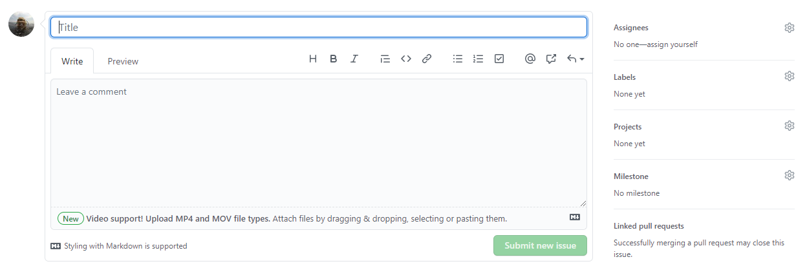

--- 
title: "Data Management SOP for the Tampa Bay Estuary Program"
author: "Marcus W. Beck, Gary E. Raulerson, Maya C. Burke, Joe Whalen, Sheila Scolaro, Ed T. Sherwood"
date: "`r Sys.Date()`"
site: bookdown::bookdown_site
output: bookdown::gitbook
documentclass: book
bibliography: [refs.bib]
biblio-style: apalike
link-citations: yes
github-repo: tbep-tech/data-management-sop
description: "This is a web page describing the TBEP data management SOP"
---

```{r, include=FALSE}
knitr::opts_chunk$set(
  comment = "#>", echo = FALSE, fig.align = 'center'
)
```

# Overview {#overview}

Welcome to the Tampa Bay Estuary Program Data Management SOP. This document describes our philosophy for managing data used by our Program and serves as motivation for our external partners to become stewards of their own data. Working together, we can improve how data are curated and used to support the continued protection and restoration of Tampa Bay.

## Contributing to this document {#contrib}

Using an open science ethos, we strongly encourage community collaboration in how this document evolves. This means anybody can contribute directly to content in this document.  Please follow the guidelines in this section to learn how to contribute and improve this SOP. 

This SOP was created using [bookdown](https://bookdown.org/), which is an approach to creating long-form documents with RMarkdown. The source code is available on the TBEP GitHub group web page: <https://github.com/tbep-tech/data-management-sop>. Each section is a plain .Rmd text file that can be edited or commented to  provide feedback on content.  There are several ways you can contribute to or edit this document.

Before you choose your editing option, you should be comfortable with Git/GitHub basics and have some working knowledge of RMarkdown files (but see \@ref(opt4)). The first step is to make sure you have a [GitHub account](https://github.com/join) so you can edit the files.  Jenny Bryan's [Happpy Git and GitHub for the useR](https://happygitwithr.com/) is an excellent resource to get started with version control.  [R Markdown: The Definitive Guide](https://bookdown.org/yihui/rmarkdown/) is a great resource for learning RMarkdown (also see the [cheatsheet](https://rstudio.com/wp-content/uploads/2015/03/rmarkdown-reference.pdf)).

### Option 1 {#opt1}

*Requires*: GitHub account, write access to the source code repository

Each section can be edited directly by selecting the edit button at the top of the page. 

```{r}

```

Clicking on the edit button will take you to GitHub, where you will see an edit page like this:

```{r, out.width = '100%'}
knitr::include_graphics('img/editme.PNG')
```

Each edit page is specific to the section where you've selected the edit button, e.g., if you click the edit button for section 2, you'll be sent to the edit page for the .Rmd file for section 2.  Feel free to make any changes on the .Rmd file.  When you're done, scroll to the bottom and "commit" your changes.  This simply means you write a few words describing the edits you've made.  Be as succinct as possible. When you're done, hit the green "Commit changes" button.  

```{r, out.width = '100%'}
knitr::include_graphics('img/editme2.PNG')
```

### Option 2 {#opt2}

*Requires*: Github account

Follow the above steps in \@ref(opt1) by navigating to a section you'd like to edit on this website and selecting the edit button. If you don't have write access to the repository, you will see something like this: 

```{r, out.width = '100%'}
knitr::include_graphics('img/editme3.PNG')
```

This simply means that you need to create your own copy to edit.  You can fork your own copy to your personal account and make your edits there. Once editing is done, you can submit a pull request to the original repository with your proposed changes.  Not sure what this means? Check out this chapter here: [https://happygitwithr.com/fork-and-clone.html](https://happygitwithr.com/fork-and-clone.html)

### Option 3 {#opt3}

*Requires*: GitHub account

If none of the above sounds appealing, you can always post any suggestions or edits as an issue under the [issues tab](https://github.com/tbep-tech/data-management-sop/issues) of the repository.  When you create a new issue by clicking the giant green "New issue" button, you'll see something like this: 

```{r, out.width = '100%'}

```

Give your issue a short but informative title (e.g., "suggests edits to section 2").  Under the "Write" tab, explain what edits or changes you'd like to see.  Feel free to select a member of the TBEP staff to assign the issue using the menu on the right.  The issues descriptions support Markdown syntax, so get creative in your descriptions (i.e., make lists, link to documents, etc., see the [cheatsheet](https://rstudio.com/wp-content/uploads/2015/03/rmarkdown-reference.pdf)).

In general, one issue should cover only one suggested change to the document.  However, multiple text edits to the same document can be submitted to the same issue so long as they cover similar topics, e.g., one issue for several suggested edits to one section.  

### Option 4 {#opt4}

*Requires*: Email

Just [email me](mailto:mbeck@tbep.org) any changes you'd like to see! 

## About

The Tampa Bay Estuary Program is one of [28 National Estuary Programs](http://nationalestuaries.org/) designated by Congress to restore and protect "estuaries of national significance." Administered by the U.S Environmental Protection Agency under the Clean Water Act, each program must develop a science-based plan using community input to protect and enhance the natural resources of its respective estuary and surrounding watershed.  

The [Comprehensive Conservation and Management Plan](http://ccmp.tbep.org/) (CCMP, updated in 2017) presents 39 actions to sustain progress in bay restoration through the year 2027.  To address the actions in our CCMP, our [2021-2025 Strategic Plan](https://drive.google.com/file/d/11xohuoaHDxNHRqgXoOHdI37FpWvac_rn/view) provides a framework to guide decisions about how to align personnel and financial resources with the Program’s mission in ways that maximize our impact on Tampa Bay recovery.  A cornerstone strategy of this plan is the use of open science principles and methods to allow the TBEP to be the primary source of trusted, unbiased, and actionable science for the Tampa Bay Estuary.  This document is a reflection of these strategies. 

Please visit our website for additional information about our program: <https://www.tbep.org>

----------

<a rel='license' href='http://creativecommons.org/licenses/by/4.0/'></a>&nbsp;&nbsp;This book is licensed under a <a rel='license' href='http://creativecommons.org/licenses/by/4.0/'>Creative Commons Attribution 4.0 International License</a>.

[](https://github.com/tbep-tech/data-management-sop/actions) This version of the book was built automatically with [GitHub Actions](https://github.com/tbep-tech/data-management-sop/actions) on `r Sys.Date()`.
