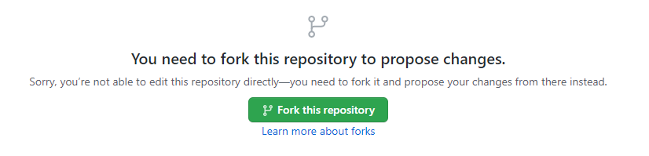

--- 
title: "Data Management SOP for the Tampa Bay Estuary Program"
author: "Marcus W. Beck"
date: "`r Sys.Date()`"
site: bookdown::bookdown_site
output: bookdown::gitbook
documentclass: book
bibliography: [refs.bib]
biblio-style: apalike
link-citations: yes
github-repo: tbep-tech/data-management-sop
description: "This is a web page describing the TBEP data management SOP"
---

```{r, include=FALSE}
knitr::opts_chunk$set(
  comment = "#>", echo = FALSE, fig.align = 'center'
)
```

# Overview {#overview}

## Contributing to this document

This SOP was created using [bookdown](https://bookdown.org/) and the source code is available on the TBEP GitHub group web page here: <https://github.com/tbep-tech/data-management-sop>.  Each section is a plain .Rmd text file that can be edited or commented to provide feedback on content.  There are several ways you can contribute to or edit this document.

Before you choose your editing option, you should be comfortable with Git/GitHub basics and have some working knowledge of RMarkdown files.  Jenny Bryan's [Happpy Git and GitHub for the useR](https://happygitwithr.com/) is an excellent resource to get started with version control.  [R Markdown: The Definitive Guide](https://bookdown.org/yihui/rmarkdown/) is a great resource for learning RMarkdown.

### Option 1 {#opt1}

*Requires*: GitHub account, write access to the source code repository

Each section can be edited directly by selecting the edit button at the top of the page. 

```{r}
knitr::include_graphics('img/editarrow.png')
```

Clicking on the edit button will take you to GitHub, where you will see an edit page like this:

```{r, out.width = '100%'}
knitr::include_graphics('img/editme.PNG')
```

Each edit page is specific to the section where you've selected the edit button, e.g., if you select edit button for section 2, you'll be sent to the edit page for the .Rmd file for section 2.  Feel free to make any changes on the .Rmd file.  When you're done, scroll to the bottom and "commit" your changes.  This simply means you write a few words describing the edits you've made.  Be as succinct as possible. When you're done, hit the green "Commit changes" button.  

```{r, out.width = '100%'}
knitr::include_graphics('img/editme2.PNG')
```

### Option 2

*Requires*: Github account

Follow the above steps in option \@ref(opt1) by navigating to a section you'd like to edit and selecting the edit button. If you don't have write access to the repository, you will see something like this: 

```{r, out.width = '100%'}

```

This simply means that you do not have write access to this repository and you need to create your own copy to edit.  Once editing is done, you can submit a pull request to the original repository with your proposed changes.  Not sure what this means? Check out this chapter here: [https://happygitwithr.com/fork-and-clone.html](https://happygitwithr.com/fork-and-clone.html)

### Option 3

*Requires*: GitHub account

If none of the above sounds appealing, you can always post any suggestions or edits as an issue under the [issues tab](https://github.com/tbep-tech/data-management-sop/issues) of the repository.  When you create a new issue by clicking the giant green "New issue" button, you'll see something like this: 

```{r, out.width = '100%'}
knitr::include_graphics('img/issues.PNG')
```

Give your issue a short but informative title (e.g., "suggests edits to section 2").  Under the "Write" tab, explain what edits or changes you'd like to see.  Feel free to select a member of the TBEP staff to assign the issue.  The issues descriptions support Markdown syntax, so get create (i.e., make lists, link to documents, etc.).

In general, one issue should cover only one change.  However, multiple text edits to the same document can be submitted to the same issue so long as they cover similar topics.  

### Option 4

*Requires*: Email

Just [email me](mailto:mbeck@tbep.org) any changes you'd like to see. 


